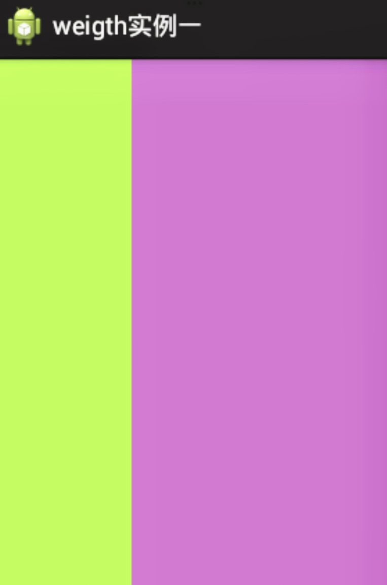
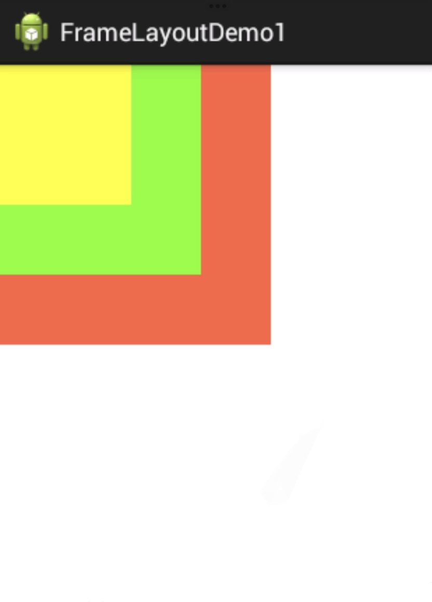

<p align="center">
    <font size="6"><strong>Android__A Swift Scanning</strong></font>
</p>

- [Android 简介](#android-简介)
  - [Android 项目目录结构](#android-项目目录结构)
  - [Android 四大组件](#android-四大组件)
- [UI 设计](#ui-设计)
  - [基本概念](#基本概念)
  - [Widgets](#widgets)
    - [基础控件](#基础控件)
    - [高级控件](#高级控件)
  - [Layout](#layout)
    - [线性布局 LinearLayout](#线性布局-linearlayout)
    - [相对布局 RelativeLayout](#相对布局-relativelayout)
    - [帧布局 FrameLayout](#帧布局-framelayout)
    - [表格布局 TableLayout](#表格布局-tablelayout)
    - [网格布局 GridLayout](#网格布局-gridlayout)
    - [约束布局 ConstraintLayout](#约束布局-constraintlayout)
- [事件监听](#事件监听)
  - [事件监听方式](#事件监听方式)
    - [使用匿名内部类](#使用匿名内部类)
    - [使用内部类](#使用内部类)
    - [使用 Activity 作为事件监听器](#使用-activity-作为事件监听器)
  - [Handler 消息传递机制](#handler-消息传递机制)
- [Activity](#activity)
  - [Activity 生命周期](#activity-生命周期)
  - [创建 Activity](#创建-activity)
  - [Intent](#intent)
    - [Intent 的投递](#intent-的投递)
  - [启动 Activity](#启动-activity)
    - [显式调用](#显式调用)
    - [隐式调用](#隐式调用)
  - [Activity 间的数据传递](#activity-间的数据传递)
    - [Intent 机制](#intent-机制)
    - [Bundle 机制](#bundle-机制)
- [数据存储](#数据存储)
- [Content Provider](#content-provider)
- [BroadcastReceiver](#broadcastreceiver)
- [Service](#service)

# Android 简介

## Android 项目目录结构

## Android 四大组件

1. Activity
2. Content Provider
3. Broadcast Receiver
4. Service

四大组件分别是：

活动（Activity），用于表现功能，一般一个页面是一个 Activity；

服务（Service），后台运行服务，不提供界面呈现；

广播接收者（BroadcastReceiver），对发送出来的广播进行过滤接受并响应；

内容提供者（Content Provider），不同应用程序之间进行数据交换的标准 API，以 URI 的形式对外提供数据，允许其他应用操作本应用程序。

# UI 设计

Android 提供了使用 XML 文件构建 UI 布局和控件，这些文件存放在 `/res/layout` 目录下。

`android.view` 类中定义了所有 UI 控件的基类 `View` 以及容纳这些控件的容器 `ViewGroup`。

## 基本概念

**长度的表示方法：**

* px
* dp
* sp
* in
* pt
* mm

**颜色的表示方法：**

* Java 中使用 Android 系统封装好的 `Color` 类常量
* Java 中使用十六进制 0x 开头的十六进制

```java
int color = 0xff00ff00;
```

* Java 中使用 `Color` 类的 `argb` 方法创建颜色

```java
int color = Color.argb(127.255.0.255);
```

* Java 中将十六进制颜色值转为 `int`

```java
int color = Color.parseColor("#00CCFF"); 
```

* XML  文件中定义颜色

```xml
<resource>
    <color name = "colorPrimary">#3F5185</color>
</resource>
```

**盒子模型**


## Widgets

`android.view.View` 类的派生类包含了所有的 Widget。

### 基础控件

* Button 按钮

```xml
<Button
    android:layout_width=""
    android:layout_height=""
    android:text=""
    android:onClick=""/>
```

* TextView 文本视图

```xml
<TextView
    android:layout_width=""
    android:layout_height=""
    android:text=""
    android:textSize=""/>
```

* EditText 编辑文本视图

```xml
<EditText
    ...
    android:inputType=""/>
```

* RadioGroup 单选按钮

```xml
<RadioGroup
    ...>

    <RadioButton
        ...
    />

    <RadioButton
        ...
    />

</RadioGroup>
```

* CheckBox 复选框

```xml
<selector
    ...>
    
    <item
        ...
    />

    <item
        ...
    />

</selector>
```

* ImageView 图片视图

```xml
<ImageView
    ...
    android:background=""
    android:src=""/>
```

### 高级控件

* Spinner
* ProgressBar
* SeekBar
* RatingBar
* TextClock
* DatePicker
* ListView
* GridView

## Layout

`ViewGroup` 类的派生类有六个：

* LinearLayout
* RelativeLayout
* FrameLayout
* AdapterView
* AbsoluteLayout
* SlidingDrawer

### 线性布局 LinearLayout

线性布局中控件只能沿垂直方向或水平方向摆放。

```xml
<LinearLayout xmlns:android="http://schemas.android.com/apk/res/android"
    xmlns:tools="http://schemas.android.com/tools"
    android:layout_width="match_parent"
    android:layout_height="match_parent"
    android:orientation="horizontal">
    
    <!-- android:orientation 表示布局的方向，vertical 代表垂直方向，horizontal 代表水平方向 -->
    
    <LinearLayout
        android:id="@+id/LinearLayout1"
        android:layout_width="0dp"
        android:layout_height="match_parent"
        android:background="#ADFF2F"
        android:layout_weight="1"/>
    
    <LinearLayout
        android:id="@+id/LinearLayout2"
        android:layout_width="0dp"
        android:layout_height="match_parent"
        android:background="#DA70D6"
        android:layout_weight="2"/>

    <!-- 
    android:id 代表控件的 ID，@id 表明后面的内容被解析为 ID，+ 表明这是一个新创建的 ID
    0dp 代表长度由权重决定，match_parent 代表填充满父容器，wrap_content 表示强制将视图扩展以显示完整的内容
    android:layout_weight 代表布局的权重，在本例中LinearLayout1 权重为 1，
    LinearLayout2 权重为 2，故前者占布局的 1/3，后者占 2/3
    -->

</LinearLayout>
```




### 相对布局 RelativeLayout

相对布局中一个控件使用其他的控件作为参考进行摆放，其常用属性：

```xml
<!--
    <RelativeLayout
        android:layout_below 放在指定控件的下边
        android:layout_toLeftOf 放在指定控件的左边
        android:layout_toRightOf 放在指定控件的右边
        android:layout_alignTop 上边界与指定控件的上边界对齐
        android:layout_alignBottom 下边界与指定控件的下边界对齐
        android:layout_alignLeft 左边界与指定控件的左边界对齐
        android:layout_alignRight 左边界与指定控件的左边界对齐
    />
-->
```

### 帧布局 FrameLayout

帧布局又叫框架布局，会在屏幕的左上角开辟一个区域放置控件。

```xml
<FrameLayout xmlns:android=""
    xmlns:tools=""
    android:layout_width="match_parent"
    android:layout_height="match_parent">
    
    <TextView
        android:layout_width="200dp"
        android:layout_height="200dp"
        android:background="#FF6143"/>
    
    <TextView
        android:layout_width="150dp"
        android:layout_height="150dp"
        android:background="#7BFE00"/>
    
    <TextView
        android:layout_width="100dp"
        android:layout_height="100dp"
        android:background="#FFFF00"/>
    
</FrameLayout>

<!--
    帧布局中可以使用 android:layout_gravity 来控制在父容器中的位置：
        top：将控件放到父容器顶端
        bottom：将控件放到父容器底端
        left：将控件放到父容器左端
        right：将控件放到父容器右端
        center_vertical：将控件垂直居中
        center_horizontal：将控件水平居中
        center：将控件水平和垂直居中
-->
```




### 表格布局 TableLayout

### 网格布局 GridLayout

### 约束布局 ConstraintLayout

约束布局与相对布局类似，以其他控件作为参考来摆放控件。

约束布局的出现是为了解决布局嵌套过多的问题。

一些约束：

```xml
<!--
    <ConstraintLayout
        app:layout_constraintLeft_toLeftOf 左边界与指定控件左边界对齐
        app:layout_constraintLeft_toRightOf 左边界与指定控件有边界对齐
        app:layout_constraintRight_toLeftOf 右边界与指定控件左边界对齐
        app:layout_constraintRight_toRightOf 右边界与指定控件右边界对齐
        app:layout_constraintTop_toTopOf 上边界与指定控件上边界对齐
        app:layout_constraintTop_toBottomOf 上边界与指定控件下边界对齐
        app:layout_constraintBottom_toTopOf 下边界与指定控件上边界对齐
        app:layout_constraintBottom_toBottomOf 下边界与指定控件下边界对齐
        app:layout_constraintBaseline_toBaselineOf Baseline 与指定控件 Baseline 对齐
        app:layout_constraintStart_toEndOf
        app:layout_constraintStart_toStartOf
        app:layout_constraintEnd_toStartOf
        app:layout_constraintEnd_toEndOf
        
        
        app:layout_constraintWidth_percent  占指定控件宽度百分比
        app:layout_constraintHeight_percent 占指定控件高度百分比
        
        
        app:layout_constraintCirecle 表明参考的对象
        app:layout_constraintCirecle_Angle 控件中心与参考对象中心的夹角
        app:layout_constraintCirecle_Radius 控件中心与参考对象中心的距离
        
        
        app:layout_constraintHorizontal_bias 水平偏移
        app:layout_constraintVertical_bias 垂直偏移
    </ConstraintLayout>
-->
```

**边距**

```xml
<!--
    android:layout_marginStart与开头的边距
    android:layout_marginEnd 与末尾的边距
    android:layout_marginLeft 左边距
    android:layout_marginTop 上边距
    android:layout_marginRight 右边距
    android:layout_marginBottom 下边距
-->
```

在约束布局中想要设置 margin，必须约束好该控件 ConstraintLayout 中的位置。

**goneMargin**

goneMargin主要用于约束的控件可见性被设置为gone的时候使用的margin值。

```xml
<!--
    layout_goneMarginStart
    layout_goneMarginEnd
    layout_goneMarginLeft
    layout_goneMarginTop
    layout_goneMarginRight
    layout_goneMarginBottom
-->
```

**居中和偏移**

水平居中

```xml
    app:layout_constraintLeft_toLeftOf="parent"
    app:layout_constraintRight_toRightOf="parent"
```

垂直居中

```xml
    app:layout_constraintTop_toTopOf="parent"
    app:layout_constraintBottom_toBottomOf="parent"
```

水平+垂直居中

```xml
    app:layout_constraintLeft_toLeftOf="parent"
    app:layout_constraintRight_toRightOf="parent"
    app:layout_constraintTop_toTopOf="parent"
    app:layout_constraintBottom_toBottomOf="parent"
```

在居中的基础上设置 margin 可实现偏移，另一种偏移方式

```xml
    app:layout_constraintLeft_toLeftOf="parent"
    app:layout_constraintRight_toRightOf="parent"
    app:layout_constraintTop_toTopOf="parent"
    app:layout_constraintBottom_toBottomOf="parent
    app:layout_constraintHorizontal_bias 水平偏移
    app:layout_constraintVertical_bias 垂直偏移
```

**尺寸约束**

控件的尺寸可以使用四种方式约束

1. 直接指定具体的数值

2. 设置为 `wrap_content`，然后可设置最大最小尺寸

3. 设置为 0dp，则依照约束设定尺寸

4. 当宽和高至少一个被设置成 0dp，可通过 `layout_constraintDimensionRatio` 设置宽高比

# 事件监听

## 事件监听方式

### 使用匿名内部类

```java
public class MainActivity extends Activity {
    private Button btnshow;
    
    @Override
    protected void onCreate(Bundle savedInstanceState) {
        super.onCreate(savedInstanceState);
        setContentView(R.layout.activity_main);
        btnshow = (Button) findViewById(R.id.btnshow);
        btnshow.setOnClickListener(new OnClickListener() {
            @Override
            public void onClick(View v) {
                /*响应代码*/
            }
        });
    }
}
```

### 使用内部类

```java
public class MainActivity extends Activity {
    private Button btnshow;
    
    @Override
    protected void onCreate(Bundle savedInstanceState) {
        super.onCreate(savedInstanceState);
        setContentView(R.layout.activity_main);
        btnshow = (Button) findViewById(R.id.btnshow);
        btnshow.setOnClickListener(new BtnClickListener);
    }
    
    class BtnClickListener implements View.OnClickListener {
        @Override
        public void onClick(View v) {
            /*响应代码*/
        }
    }
}
```

### 使用 Activity 作为事件监听器

```java
public class MainActivity extends Activity {
    private Button btwshow;

    @Override
    protected void onCreate(Bundle savedInstanceState) {
        super.onCreate(savedInstanceState);
        setContentView(R.layout.activity_main);
        btnshow = (Button) findViewById(R.id.btnshow);
        btnshow.setOnClickListener(this);
    }

    @Override
    public void onClick(View v) {
        /*响应代码*/
    }
}
```

## Handler 消息传递机制

Handler 的主要工作就是为了满足UI线程和工作线程间（子线程）的通信，主要作用有两个：

* 在新启动的线程发送消息

* 在主线程中获取、处理消息

由三部分构成：

* Handler
* MessageQueue
* Looper


新线程将消息发送至 MessageQueue，然后 Handler 不断从 MessageQueue 中获取并处理消息。Handler 从 MessageQueue 中读取消息就要用到 Looper，Looper 的 loop 方法负责读取 MessageQueue 中的消息，读取消息之后把消息发送给 Handler 来处理。

# Activity

## Activity 生命周期


Activity 的四种状态

随着 Activity 生命周期各个方法的调用,产生了 Activity 的四种基本状态。

• Active/Runing 状态：活动状态。一个新的 Activity 入栈后，它在屏幕最前端，处于栈的最顶端，处于可见并且可交互的激活状态。

• Paused 状态：暂停状态。当 Activity 被另一个透明或者 Dialog 样式的 Activity 覆盖时的状态。此时它依然与窗口管理器保持连接，系统继续维护其内部状态，所以它仍然可见，但它已经失去了焦点故不可与用户交互。

• Stoped 状态：停止状态。当 Activity 被另一个 Activity 覆盖，失去焦点并不可见时的状态。

• Killed/Destroy 状态：非活动状态。Activity 被系统杀死回收或者没有被启动时的状态。此时，待用 Activity 被移除 Activity 栈，并且需要在显示和可用之前重新启动它。

## 创建 Activity

在 AndroidManifest.xml 文件中注册 Activity，在 `<application>` 标签下添加 `<activity>` 标签：

```xml
<manifest ...>
    <application ...>
        <activity android:name=".MainActivity">
            <intent-filter>
                <action android:name="android.intent.action.MAIN"/>
                <category android:name="android.intent.category.LAUNCHER"/>
            </intent-filter>
        </activity>
    </application>
</manifest>
```

创建布局文件 activity_main.xml：

```xml
<!-- 布局文件 -->
```

创建 MainActivity 类：

```java
public class MainActivity extends Activity {
    @Override
    protected void onCreate(Bundle savedInstanceState) {
        super.onCreate(savedInstanceState);
        setContentView(R.layout.activity_main);
    }
}
```

## Intent

Intent 机制用来协助应用进行交互和通信，不仅可用于应用程序之间，也可以用于应用程序内部的 Activity 和 Service。

Intent 中的属性有：

* Action 指 Intent 的执行动作
* Data 指执行动作的 URI
* Category 指执行动作的附加类别信息，只有设置了这个 Action 才有效
* Type 指执行动作的 MIME 类型
* Component 用于显式指定 Intent 所对应的组件
* Extras 添加一些附加信息，主要用于组件之间通信
* Flag 标志位

### Intent 的投递

1. 显式方式：直接设置目标组件的 ComponentName，主要适应于一个项目内部组件的消息传递。使用 `setClassName`、`setComponent()` 函数等方式确定目标组件。

2. 隐式方式：此方式不明确需要启动的组件名称，一般用于调用其他项目的组件。需要设置 Intent 的其他属性，如 action、data 和 category，并在 Manifest.xml 文件中设置 intent-filter 在所有组件中过滤相同意图来匹配目标组件。

## 启动 Activity

### 显式调用

```java
    /*1.*/
    Intent intent = new Intent(当前的活动.this, 启动的活动.class);
    startActivity(intent);
    
    /*2.*/
    ComponentName cn = new ComponentName("当前活动的全限定类名", "启动活动的全限定类名");
    Intent intent = new Intent();
    intent.setComponent(cn);
    startActivity(intent);
    
    /*3.*/
    Intent intent = new Intent();
    intent.setClassName(this, "启动的类名");
    startActivity(intent);
```

### 隐式调用

```java
    Intent intent = new Intent;
    intent.setAction("myaction");
    intent.setCategory("mycategory");
    startActivity(intent);
```

在 AndroidManifest.xml 文件中找到调用的 Activity，设置 `<intent-filter>` 中的 action 和 category 属性。

## Activity 间的数据传递

### Intent 机制

```java
    /*发送消息*/
    Intent intent = new Intent;
    intent.setClass(this, 启动的活动.class);
    intent.putExtras("user", user);
    startActivity(intent);

    /*获取消息*/
    Intent intent = getIntent();
    getStringExtras("user");
```

### Bundle 机制

```java
    /*发送消息*/
    Bundle Bundle = new Bundle();
    bundle.putString("name", "Listen");
    bundle.putInt("ID", "100001");
    Intent intent = new Intent(this, 启动的活动.class);
    intent.putExtras(bundle);
    startActivity(intent);

    /*获取消息*/
    Intent intent = getIntent();
    Bundle bundle = intent.getExtras();
    String name = bundle.getString("name");
    Int ID = bundle.getInt("ID");
```

# 数据存储

在 Android 平台中进行数据存储主要有五大方式：

1. 使用 SharedPreferences 存储数据：该方式是基于 XML 文件的存储方式，保存“key-value”键值对数据。这些信息的特点是：数据量少，格式非常简单，多数为字符串型等基本类型。通常，此方式主要用来存储一些简单的配置信息。例如，应用程序的各种配置信息(如是否打开音效，是否使用震动效果,是否反转屏幕等)，也可以是系统的解锁口令密码等配置信息。

2. 文件存储数据：Activity 类提供了 openFileOutput() 方法用于把数据流输出到文件中，具体的实现过程与在 J2SE 环境中保存数据到文件中相同。文件可用来存放大量数据，如文本、图片、音频等。

3. SQLite数据库存储数据：SQLite 是轻量级嵌人式数据库引擎，它支持 SQL 语言，并且占用很少的内存便可以表现出良好的性能。现在的主流移动设备如 Android、iPhone等都使用 SQLite 作为复杂数据的存储引擎。SQLite 主要用来存储大量的结构化数据。通过利用虚拟机和虚拟数据库引擎(VDBE)，使调试，修改和扩展 SQLite 的内核变得更为方便。其特点是：面向资源有限的设备，没有服务器进程，允许所有数据存放在同一文件中跨平台，可实现自由复制。

4. 使用 ContentProvider 存储数据：该方式主要面向对外数据的共享和操作。应用维承 ContentProvider 类，并重写该类用于提供数据和存储数据的方法，就可以向其他应用来享其数据。虽然使用其他方法也可以对外共享数据，但数据访向方式会因数据存储的方式而不同。

5. 网络存储数据：这是通过网络来实现数据的存储和获取的方法。但是该方法需要设备保持网络连接状态，所以具有一定的限制。将数据存储到网络上的方法很多，如将需要保存的数据以文件的方式上传到服务器、发送邮件等。

结合 Android 开发中的实际经验，对比这几种数据存储方式，给出如下建议：

* 简单数据和配置信息存储，首选 SharedPreference 方式

* 数据量大的结构化数据，建议使用 SQLite 数据库

* 文件方式主要用来存储非配置信息或结构化数据，如文本文件、二进制文件、多媒体文件，下载的文件等。建议尽量少用文件方式存储数据，若是私密文件或重要文件，建议将数据存储在应用内部

# Content Provider

# BroadcastReceiver

广播接收器是 Android 系统的一个全局监听器，用于监听系统发来的广播消息。

1. 静态注册（在 AndroidManifest.xml 文件中注册）在配置文件中注册的接收者的特点是即使应用程序已经关闭，该接收者仍然可以接受到他感兴趣的广播。

2. 动态注册（在 Activity 中注册）在 Activity 中绑定接收者必须依附该应用程序存在，则程序关闭后就不需要再接收广播。

一般情况下广播接收者的使用步骤如下：

1. 自定义类 MyReceiver 继承 BroadcastReceiver
2. 重写 onReceive()
3. 注册广播接收者

# Service


startService 启动 Service

1. 首次启动会创建一个 Service 实例，依次调用 onCreate() 和 onStartCommand() 方法，此时 Service 进入运行状态，如果再次调用 StartService 启动 Service 将不会再创建新的 Service 对象，系统会直接复用前面创建的 Service 对象，调用它的 onStartCommand() 方法!

2. 但这样的 Service 与它的调用者无必然的联系，就是说当调用者结束了自己的生命周期，但是只要不调用 stopService()，那么 Service 还是会继续运行的!

3. 无论启动了多少次 Service，只需调用一次 stopService() 即可停掉 Service。


bindService 启动 Service

1. 当首次使用 bindService 绑定一个 Service 时，系统会实例化一个 Service 实例，并调用其 onCreate() 和 onBind() 方法，然后调用者就可以通过 IBinder 和 Service 进行交互了，此后如果再次使用 bindService 绑定 Service，系统不会创建新的 Sevice 实例，也不会再调用 onBind() 方法，只会直接把 IBinder 对象传递给其他后来增加的客户端!

2. 如果我们解除与服务的绑定，只需调用 unbindService()，此时 onUnbind 和 onDestory 方法将会被调用！这是一个客户端的情况，假如是多个客户端绑定同一个 Service 的话，情况如下当一个客户完成和 Service 之间的互动后，它调用 unbindService() 方法来解除绑定。当所有的客户端都和 Service 解除绑定后，系统会销毁 Service。(除非 Service 也被 startService() 方法开启)

3. 另外，和上面那张情况不同，bindService 模式下的 Service 是与调用者相互关联的，在bindService后，一旦调用者销毁，那么 Service 也立即终止!
