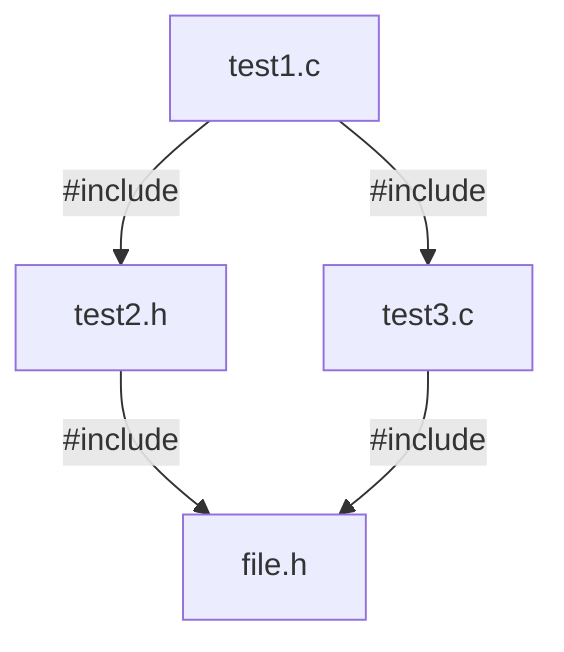

# Pure C

C 语言是一个系统级的高级程序设计语言，是需要编译执行的静态语言，广泛应用于操作系统、驱动程序、嵌入式软件、系统级应用和游戏的开发，C 语言是最接近底层的高级语言。

C 语言编译执行的过程：

1. 预处理

    对源程序进行预处理替换，呈现出完整的程序。

    **.c file** $\longrightarrow$ **.i file**

2. 编译

    将预处理后的程序编译成汇编程序。

    **.i file** $\longrightarrow$ **.s file**

3. 汇编

    将汇编程序转换为机器指令。

    **.s file** $\longrightarrow$ **.o file**

4. 链接

    链接库文件并生成可执行文件。


## 预处理

预处理包括：

* 预处理指令：`#define`、`#include` 等
* 预处理运算符：`#`、`##` 等
* 预定义宏：

  * `__LINE__`：当前编译行的行号
  * `__FILE__`：当前编译源程序的文件名
  * `__DATE__`：当前编译源程序的创建日期
  * `__TIME__`：当前编译源程序的创建时间
  * `__STDC__`：判断编译器是否为标准 C

### 宏定义

`#define` 可以定义一个宏以表示某个字符串，代码中的宏都会被替换成其对应的字符串。

有两种形式：

1. 不带参数的宏定义

```c
/*
 * #define macro string
 */
#define PI 3.14159 // 程序中的 PI 会被替换成 3.14159
#define PRINT fprintf(stdout, "helloworld!\n") // PRINT 会被替换为后面的语句
#define HELLO "hello\
world" // 可以使用 \ 连接下一行
```

`#define` 与 `typedef` 的区别：前者是简单的文本替换，后者则代表了一种数据类型。

Demo：

```c
#define INT1 int *
typdef int* INT2

int main() {
    INT1 a1, b1; // a1 为 int * 型，b1 为 int 型
    INT2 b2, b2; // a2、b2 都为 int * 型
    int a = 1;
    const INT1 a3 = &a; // a3 为常量指针，指向的地址可变，但所指地址的内容不能变
    const INT2 a4 = &a; // a4 为指针常量，不可改变指向的地址，但可以改变该地址的内容
} 
```

2. 带参数的宏定义

```c
/*
 * #define macro(parameter_list) string
 */
#define ADD(X,Y) ((X)+(Y))
ADD(1,2); // 预处理阶段会被替换为 ((1)+(2))

#define SUM(X,Y) printf(#X"+"#Y"=%d\n", ((X)+(Y))) // # 把参数转换为字符串
SUM(1,2); // 将会替换为 printf("1""+""2""=%d\n", ((1)+(2)))，即输出 1+2=3

#define LINK(X,Y) (X##Y) // ## 用于连接两个标记
LINK(hello,world) // 连接为 helloworld

/* 宏可以带有可变参数，用 ... 表示，__VA_ARGS__ 在预处理时被实际的参数替换 */
#define PRINT(fmt,...) fprintf(stdout, fmt"\n", ##__VA_ARGS__)
PRINT("%d","1");  // fprintf(stdout, "%d""\n","1");
PRINT("helloword!"); // fprintf(stdout, "helloword!""\n");
```

上面的代码中包含一些预处理运算符，`\` 是行连接运算符，`#` 是字符串化运算符，`##` 是标记连接运算符，除此之外还有 `#@` 是字符化运算符。

注意：

最好在参数左右以及整个字符串的左右加上括号，以免替换后出现运算符优先级的问题。

Demo：

```c
#define MUL(X,Y) X*Y // 期望该宏用于表示两个参数的乘积

int main() {
    int a = MUL(1 + 2,3); // 期望 a 为 3 乘 3
    int b = 5 / MUL(1,2); // 期望 b 为 5 除以 2
}
```

预处理之后程序被替换成了：

```c
int main() {
    int a = 1 + 2*3;
    int b = 5 / 1*2; 
}
```

所得的程序并非期望中的结果，因为出现了运算符优先级的问题，所以最好在参数左右以及整个字符串的左右加上括号，变成 `#define MUL(X,Y) ((X)*(Y))`。

`#undef` 用于撤销之前定义过的宏，也就是说宏的生命周期从 `#define` 开始到 `#undef` 结束。

为什么要使用宏定义？

### 条件编译

1. `#if` `#else` `#elif` `#else`

与 C 语言中的 `if-else if-else` 类似，根据满足的条件选择编译的代码片段。

```c
#if condition
    statement
#elif condition
    statement
/*
 * ......
 */
#else 
    statement
#endif
```

2. `#ifdef` `#ifndef`

`#ifdef` 用于判断某个宏是否被定义，`#ifndef` 则相反，判断某个宏是否未被定义。

```c
#ifdef macro_identifier
    statement
#elif condition
    statement
/*
 * ......
 */
#else
    statement
#endif
```

3. `#pragma` 的作用是设定编译器状态，或指定编译器完成一些特殊的行为。

可提供的编译器指令很多，其中常用的有：

```c
#pragma once // 保证文件只被编译一次
#pragma message(message) // message 会在编译输出窗口显示
#pragma code_seg(["section-name"][""]) // 设置程序中函数代码存放的代码段
```

4. `#error` 的作用是在编译程序时只要遇到 `#error` 就会生成一个错误的消息，并停止编译。

```c
#error message // 将显示错误 message 并停止编译
```

5. `#line` 的作用是改变 `__LINE__` 和 `__FILE__` 的内容，前者存放正在编译行的行号，后者存放正在编译的文件的文件名。

Demo：

```c
/*
 * #line line "file"
 */
#include <stdio.h>
#line 100 "test.c"

int main() {
    printf("%s: %d", __FILE__, __LINE__);
}
```

将会输出：test.c: 102

### 文件包含

`#include` 可以使一个文件的全部内容都包含（即复制）到本文件中，有两种形式：

```c
#include <file> // 使用尖括号包含 file
#include "(path)file" // 使用双引号包含 file
```

区别在于，使用尖括号时编译器会到 C 标准库中寻找要包含的文件。使用双引号时，编译器先在当前目录（或指定目录）下寻找要包含的文件，如果寻找不到再到 C 标准库中寻找。

如果要包含 C 标准库中的文件，则使用尖括号；如果要包含其他位置的文件，则使用双引号。

Demo：两个文件 test1.c 和 test2.c 如下：

```c
/* test1.c */
int main() {
    int a = 1;
}

/* test2.c */
#include "test1.c"
```
使用 GCC 进行预处理 `gcc -E test2.c -o test2.i`，查看 test2.i 文件：

```bash
# 1 "test2.c"
# 1 "<built-in>"
# 1 "<command-line>"
# 31 "<command-line>"
# 1 "/usr/include/stdc-predef.h" 1 3 4
# 32 "<command-line>" 2
# 1 "test2.c"
# 1 "test1.c" 1
int main() {
    int a = 1;
}
# 1 "test2.c" 2
```

可见将 test1.c 的内容完全复制到了 test2.c。

当文件嵌套包含时会出现问题，譬如:



由此以来会有两份 file.h 的内容被拷贝到 test1.c 中，如果 file.h 中存在宏或全局变量，则会导致重复定义。

为解决这种情况，可以在每个文件开头写入：

```c
#ifndef __TEST_H__ // 假设该文件为 test.h
#define __TEST_H__
/*
 * 文件的内容
 */
#endif
```

或者在文件开头写入：

```c
#pragma once // 保证文件值被编译一次
```

## 基本数据类型

C 语言的基本数据类型分为两大类：

* 以**整数**形式存储的数据类型：

  * 字符型 char、整数型 int、短整数型 short int（简称 short）、长整数型 long int（简称 long）
  * 无符号字符型 unsigned char、无符号短整数型 unsigned short、无符号整数型 unsigned int、无符号长整数型 unsigned long。

* 以**浮点数**形式存储的数据类型：

  单精度浮点数型 float、双精度浮点数型 double、长双精度浮点数型 long double。

在 32 位或 64 位编译器下：

|类型|存储字节|范围|
|--|--|--|
| int | 4 | [-2<sup>31</sup>, 2<sup>31</sup> - 1] |
| unsigned int | 4 | [0, 2<sup>32</sup> - 1] |
| short | 2 | [-2<sup>15</sup>, 2<sup>15</sup> - 1] |
| unsigned short | 2 | [0, 2<sup>16</sup> - 1] |
| long | 4 或 8 | [-2<sup>31</sup>, 2<sup>31</sup> - 1] 或 [-2<sup>63</sup>, 2<sup>63</sup> - 1] |
| unsigned long | 4 或 8| [0, 2<sup>32</sup> - 1] 或 [0, 2<sup>64</sup> - 1] |
| char | 1 | [-128, 127] 或 [0, 255] |
| unsigned char | 1 | [0, 255] |
| signed char | 1 | [-128, 127] |
| float | 4 | [1.2E-38, 3.4E+38] 精度 6 ~ 7|
| double | 8 | [2.3E-308, 1.7E+308] 精度 15 ~ 16|
| long double | 8 或 12 或 16| 略|

这些数据类型是如何存储的？为什么不同数据类型的存储字节数不同？请学习[组成原理_数据的表示与运算]()

### 常量和变量

1. 常量

常量的定义：

```c
/*
 * 1.使用 #define
 * #define identifier value
 */
#define LENGTH 100

/*
 * 2.使用 const
 * const data_type identifier = value;
 */
const int WIDTH = 50;
```

常量的表示方法：

```c
/* 整数常量 */
a = 100; // 十进制 100
b1 = 100u; // 无符号 100
b2 = 100U; // 无符号 100
b3 = 100l; // 长整数 100
b4 = 100L; // 长整数 100
b5 = 100ul; // 无符号长整数 100
c1 = 077; // 八进制 77
c2 = 0xFF; // 十六进制 FF
c3 = 0XFF; // 十六进制 FF

/* 浮点数常量 */
d1 = 3.1415; // 小数 3.1415
d2 = 31415E-5; // 科学计数法 3.1415
d3 = 31415e-5; // 科学计数法 3.1415

/* 字符型常量 */
e1 = 'a'; // 单引号表示字符，字符 a
e2 = 97; // 以 ASCII 码表示字符 a

/* 字符串常量 */
"HelloWorld" // 双引号表示字符串，字符串 HelloWorld，所有字符串都以 '\0' 结尾
```

ASCII 码表


转义字符:

|转义字符|意义|ASCII码值|
|-|-|-|
|\\a|响铃（BEL）|007|
|\\b|退格（BS），将当前位置移到前一列|008|
|\\f|换页（FF），将当前位置移到下页开头|012|
|\\n|换行（LF），将当前位置移到下一行开头|010
|\\r|回车（CR），将当前位置移到本行开头|013|
|\\t|水平制表（HT），跳到下一个 TAB 位置|009|
|\\v|垂直制表（VT）|011|
|\\\\|代表一个反斜线字符 '\\'|092|
|\\'|代表一个单引号字符|039|
|\\"|代表一个双引号字符|034|
|\\?|代表一个问号|063|
|\\0|空字符（NULL），所有字符串都以 \0 结尾|000|
|\\ddd|八进制数所代表的任意字符|1～3 位八进制|
|\\xhh|十六进制所代表的任意字符|1~2 位十六进制|

2. 变量

* 变量的作用域：变量可以被使用的范围，如果在外部定义，则作用域为全局，如果在局部代码块内定义，则作用域为块作用域。

* 变量的生存期：变量在程序执行过程中的存留时间。

四种存储类型：

* `auto` 类型，局部变量的默认类型，存储在内存中的栈区，作用域和生存期都在局部代码块内。

* `register` 类型，存储在 CPU 寄存器而不是内存中的局部变量，用于存储使用频率高的变量，一般编译器会自动将使用频繁的变量存储至寄存器。
  
  > 要注意的是由于机器字长的限制，只推荐将一些存储位数少的类型声明为 register 类型，如 char、short、int。

* `static` 类型，全局变量的默认类型，存储在内存中的静态存储区，如果修饰局部变量，则该局部变量变为静态局部变量，在整个程序的生命周期保持存在，不会因进出作用域而创建和销毁。如果修饰全局变量，则会将变量的作用域限制在文件内。

* `extern` 类型，可以理解为在其他文件中声明了一个全局变量或函数，要在本文件中使用这个全局变量或函数，一般用于多个文件共享一个全局变量或函数。

变量的声明和定义：

```c
/*
 * 变量的声明：
 * store_type data_type indentifier;
 * store_type 默认为 auto 或 static
 */
int a;
auto int b;

/*
 * 变量的初始化：
 * store_type data_type indentifier = value;
 */
static int c = 2；
```

> identifier 标识符，其必须满足：
> * 其中只能使用字母、数字和下划线
> * 第一个字符不能是数字
> * C 语言保留的关键字不能用作标识符
> * 以下划线开头的变量多用于表示标准库中的变量，尽量不要在程序中使用
> * 以双下划线或下划线加大写字母开头的变量名多用于表示编译器中的变量，尽量不要在程序中使用

### 类型转换

1. 自动类型转换

当参与运算的两个数据是不同的数据类型，存储位数低的数据类型会自动转换为存储位数高的数据类型，即：

$$
\begin{aligned}
char \longrightarrow short \longrightarrow int &\longrightarrow long \longrightarrow float \longrightarrow double \\
signed &\longrightarrow unsigned
\end{aligned}
$$

```c
int a = 7;
float b = 3.5;
float c = a / b; // a 会自动转换为 float
```

2. 赋值进行的类型转换

C 语言允许将另外一种类型的语赋值给另外一种语言，值将被转换成接收变量的类型。

```c
float a = 1.5;
int b = a; // b 的值为 1 
```

3. 强制类型转换

在 C 语言中可以使用 `(类型)变量或表达式` 来进行强制类型转换：

```c
/*
 * (transform_type)identifier or expression
 */
float a = 3 / 2; // a 的值为 1
float b = (float)3 / 2; // b 的值为 1.5
float c = (float)(3 / 2); // c 的值为 1
```

注意：

由整数（int、long）转换为单精度浮点型有时候会出现问题：

Demo：

```c
int a = 16777217; // 2 的 24 次方加 1
float b = a;
printf("%f\n", b); // 将会输出 16777216.00000
```

这种情况与 float 型在内存中的存储格式有关，float 类型中有 23 个比特位用于表示整数部分，而 int 型有 32 个比特位，当要转换为 float 型的整数需要大于 23 个比特位存储时，就需要进行舍入到最后一位为 0，故值会发生改变。

存储位数高的类型转换为存储位数低的类型，可能会出错：

* double 型赋值给 float 型，精度下降，值可能会超出取值范围。 
* 浮点数赋值给 int 型，只保留整数部分，值可能超出取值范围。
* long 型赋值给 int 或 short 型，值可能超出取值范围，通常只复制右边的字节。

## 表达式

### 左值和非左值

### 运算符

运算符根据操作数的数量分为单目运算符、双目运算符和三目运算符。

1. 算术运算符

|运算符|作用|
|-|-|
|+|（单目）正值|
|-|（单目）负值|
|+|两个操作数相加|
|-|前一个操作数减去后二个操作数|
|\*|两个操作数相乘|
|\/|前一个操作数除以后二个操作数|
|\%|后一个操作数除前一个操作数的余数|

2. 关系运算符

|运算符|作用|
|-|-|
|\==|等于|
|!=|不等于|
|<|小于|
|<=|小于等于|
|>|大于|
|>=|大于等于|

3. 逻辑运算符

|运算符|作用|
|-|-|
|!|逻辑非|
|&&|逻辑与|
|\|\||逻辑或|

4. 位运算符

|运算符|作用|
|-|-|
|~|（单目）位求反|
|<<|位左移|
|>>|位右移|
|&|位与|
|\||位或|
|^|位异或|

5. MISC

`=` 赋值运算符 

`++` 自增运算符，值加 1，`--` 自减运算符，值减 1。这两个运算符前置和后置会带来不同的效果，前置会直接将操作数的值加或减 1，后置会先将操作数保留一个副本然后再让操作数加或减 1，使用这个副本参与表达式中的其他运算。

Demo：

```c
int i = 1, j = 1;
int k1 = ++i; // k1 为 2，i 为 2
int k2 = j++; // k2 为 1，j 为 2
```

> 建议：非必要不使用后置的自增或自减运算符，因为前置不会产生不必要的工作。

`sizeof` 运算符返回一个表达式或者类型所占的字节数，返回的类型是 long unsigned int 类型。

```c
/*
 * sizeof (data_type)
 * sizeof expression
 */
int a;
printf("%ld\n", sizeof (int)); // 输出 4
printf("%ld\n", sizeof a); // 输出 4
printf("%ld\n", sizeof (sizeof a)); // 输出 8，因为是 long unsigned int 型
```

逗号运算符，连接两个表达式，先计算左边的表达式再计算右边的表达式，但最终整个表达式的结果为右侧表达式的值。

Demo：

```c
int i;
printf("%d\n", (i = 1, i = 2, i = 3)); 
```

将输出 3，也就是最右边的表达式的值。

C 语言为一的三目运算符 `?:`，条件运算符：

```c
condition ? statement1 : statement2;
```

### 优先级和结合性

## 语句结构

### 选择结构

```c
/* if-else 型 */
if (condition1) {
    statement
} else if (condition2) {
    statement
} 
  /*
   * ......
   */ 
  else {
    statement
}

/* switch-case 型 */
switch (identifier or expression) {
    case value1:
        statement
    case value2:  
        statement
    /*
     * ......
     */
    break; // 只有遇到 break 才会终止
    default:
        statement
}
```

除此之外还可以使用三目运算符 `?:` 来表示选择结构：

```c
condition ? statement1 : statement2;
```

若 condition 为真，则执行 statement1，否则执行 statement2。

### 循环结构

```c
/* while 型 */
while (condition) {
    statement
}

/* do-while 型 */
do {
    statement
} while (condition)

/* for 型 */
for (initializing; condition; addition) {
    statement
}
```

### 跳转语句

1. break & continue

break 和 continue 都能使程序跳过代码块中的后续代码。二者的区别是，如果在一个循环中使用 break 或 continue，break 的作用是跳过循环的剩余部分到达下一个语句，continue 的作用是跳过循环的剩余部分并进行下一轮循环。

```c
/* break */
while (condition) {
	statement1;
	break; // 将跳转到 statement3
	statement2;
}
statement3;

/* continue */
while (condition) {
	statement1;
	continue; // 将跳转到 while 进行下一轮循环
	statement2;
}
```

2. return

使用 return 关键字可以结束当前执行的函数，并返回一个具体的值到调用该函数的位置。

使用 return 语句可以用来规避 if-else 多层嵌套：

Demo：

```c
void f(int a[], int 4) {
	char *result;
	if (a[0] < 0) {
		if (a[1] < 0) {
			if (a[2] < 0) {
				if (a[3] < 0) {
					result = "valid\n";
				} else {
					result = "a[3] >= 0\n";
				}
			} else {
				result = "a[2] >= 0\n";
			}
		} else {
			result = "a[1] >= 0\n";
		}
	} else {
		result = "a[0] >= 0\n";
	}
	return result;
}

/* 可改写为： */
void f(int a[], int 4) {
	if (a[0]) return "a[0] >= 0\n";
	if (a[1]) return "a[1] >= 0\n";
	if (a[2]) return "a[2] >= 0\n";
	if (a[3]) return "a[3] >= 0\n";
	return "valid\n";
}
```

3. goto

使用 goto 关键字将控制无条件转移至目标位置，

```c
/ *
  * goto label
  * label 是跳转目标的标签
  */
	int n = 1;
label:;
	int a[n];
	if (n++ < 10)
		goto label;
```

## 复合数据类型

### 一维数组

数组是一种复合数据类型，

```c
/*
 * 一维数组的声明
 * store_type data_type identifier[length];
 * length 代表数组的长度即元素个数
 */
int a[10];
 
 /*
  * 数组的初始化
  * store_type data_type identifier[length] = {value_list};
  * length 可以省去
  */
int b1[5] = {1, 2, 3, 4, 5}; // {1, 2, 3, 4, 5}
int b2[] = {1, 2, 3, 4, 5}; // {1, 2, 3, 4, 5}
int b3[5] = {1, 2, 3, 4}; // {1, 2, 3, 4, 0} 未初始化的元素被设为 0
int b4[] = {1, 2, 3, 4}; // {1, 2, 3 ,4}
```

如果在声明数组时没有进行初始化，则后续无法再使用初始化列表进行初始化，如：

```c
int c[5];
c[5] = {1, 2, 3, 4, 5}; // Invalid
```

也无法将一个数组名直接赋值给另一个，如：

```c
int d[3] = {1, 2, 3};
int e[3];
e = d; // Invalid
```

使用 `数组名[下标]` 的方式表达数组元素，下标 0 表示数组的第一个元素。

```C
int f[3] = {1, 2, 3};
printf("%d %d %d\n", f[0], f[1], f[2]); // 1 2 3
```

数组名可以代表数组首元素的地址，即指向数组首地址的指针。

### 多维数组

多维数组的声明和初始化：

```c
/*
 * 多维数组的声明
 * store_type data_type identifier[length1][length2];
 */
int a[2][3] = {{1, 2, 3}, {4, 5, 6}};
```

多维数组的本质是将数组作为元素的数组，上述的 `a[2][3]` 中，可认为数组 a 有两个元素，元素的类型是 `int[3]`。 

### C-风格字符串

C-风格字符串指字符数组，也就是元素类型为 char 型的数组。

字符数组的定义和初始化，以下三种方式都对：

```c
char str[] = {'h', 'e', 'l', 'l', 'o', ' ', 'w', 'o', 'r', 'l', 'd', '!'};
char str[] = "hello world!";
char str[] = {"hello world!"};
```

C 语言中字符串均以 `\0` 结尾，也就是说如果以字符串的赋值字符数组，那字符数组的最后一个元素一定是 `\0`。

```c
char str[5] = {'1', '2', '3', '4', '5'}; // 正确
char str2[5] = "12345"; // Error，因为最后一个元素是 \0 应该有 6 个元素

char str[] = {'1', '2', '3', '4', '5'};
char str2[] = "12345";
printf("%ld\n", sizeof str); // 5
printf("%ld\n", sizeof str2); // 6
```

C 语言中用于字符串操作的函数：

1. strcpy
2. strlen
3. str

### 枚举类型

```c
/*
 * 枚举的定义：
 * enum identifier {
 *     element1,
 *     element2,
 *     ......
 * };
 */
enum week {
    Monday=1,
    Tuesday,
    Wednesday,
    Thursday,
    Friday,
    Saturday,
    Sunday
};
```

### 结构体类型

C 语言中没有 class 这一类型，但提供了 struct 类型以表示由多个成员组成的数据类型。

```c
/* 
 * 结构体的定义：
 * struct identifier {
 *     member_list
 * };
 * 结构体变量的声明
 * struct struct_identifier var_identifier;
 */
struct Student {
    int id;
    char sex;
    int age;
    char name[10];
};
struct Student Allen;

/*
 * 也可以不定义结构体标识符的直接定义结构体变量
 * struct {
 *     member_list
 * } identifier;
 */
struct {
	int id;
    char sex;
    int age;
    char name[10];
} Allen, Bob;
```

结构体变量的初始化：

```c
struct Student A = {1, 'm', '20', "Allen"};
struct Student B = A; // 同类型结构体变量可以直接赋值
```

访问结构体变量的成员：

```c
struct Student A;
int a = A.age; // 可以使用 . 访问结构体便利的成员

struct Student *p;
int b = p->age; // 也可以使用结构体指针访问成员
```

当结构体当中含有长度未知的数组即柔性数组：

```c
struct s {
    int a;
    int b[]; // 柔性数组
};

struct s s1 = {1, {2, 3}}; // Invalid，因为 b 的长度未知
struct s *s2 = malloc(sizeof (struct s) + (sizeof (int) * 5)); // 此时柔性数组为 b[5]
```

### 共用体类型

共用体是特殊的结构体，允许在相同的内存位置存储不同的数据类型，只有一个成员是带有值的。

```c
/*
 * 共用体类型的定义
 * union identifier {
 *     member_list
 * };
 */
union 
```

### typedef

`typedef` 关键字的作用是给复杂的数据类型起一个别名，可以在定义复杂的数据类型时使用：

```c
typedef struct Student {
	int age;
	int id;
	float heigtht;
	float weight;
} stu;

// struct Student a;
stu a;
```

## 指针

指针

C 语言中的空指针 `NULL`

```c
#define NULL ((void *)0)
```

C++ 中的空指针 `NULL`

```cpp
#define NULL 0
```

## 函数

函数是 C 语言中重要的概念，C 程序执行时会在不同的函数之间跳转。

C 语言是需要编译的语言，程序中函数在被调用之前必须声明。

```c
/*
 * 函数的声明
 * (extern) return_type func_identifier(parameter_list);
 * 函数在声明时候参数列表可以只写数据类型，extern 表示引用其他文件的函数
 */
int Add(int);

/*
 * 函数的定义：
 * return_type func_identifier (parameter_list) {
 *     statement
 * }
 */
int Add(int a) {
    return ++a;
}
```

### 函数参数

函数的参数列表中的参数叫做形式参数

1. 值传递参数
2. 地址传递参数

可变参数函数

### 函数返回值

返回值类型缺省，则默认为 int 型。

### 函数调用

main 函数是 C 语言程序的入口函数，它的完整形式为：

```c
int main(int argc, int argv[])
```

函数调用栈帧

## 标准 I/O

什么是标准 I/O？什么是文件 I/O？

> 1


### fopen & fclose

### fputc & fgetc

### fputs & fgets

### fprintf & fscanf

### fread & fwrite

## 内存管理

### 内存组织方式

### 动态内存管理

1. malloc
2. free
3. calloc
4. realloc

### 缓冲区溢出

## C89 标准库

## C99
