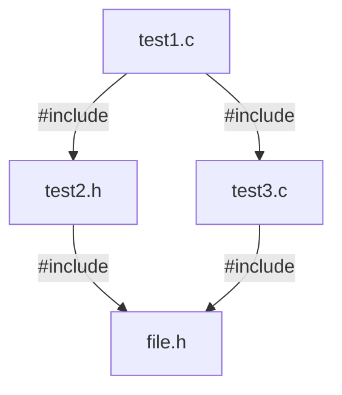

# C

## 摘要

C 语言是一个系统级的高级程序设计语言，是需要编译执行的静态语言，广泛应用于操作系统、驱动程序、嵌入式软件、系统级应用和游戏的开发，C 语言是最接近底层的高级语言。

C 语言发展历程：

* C 语言诞生于美国贝尔实验室，1989 年美国国家标准协会（ANSI）发布了第一个 C 语言标准，简称 C89 或 ANSI C。
* 1990 年 ANSI C 标准被国际标准化组织（ISO）和国际电工委员会（IEC）采纳为国际标准，简称 C90。
* 1994、1996 年 ISO 发布了对 C90 的勘误和补充，简称 C95。
* 1999 年 ISO 与 IEC 采纳了重大修订的第二个的 C 语言标准，简称 C99。
* 2011 年 ISO 与 IEC 采纳了第三个 C 语言标准，简称 C11。
* 2018 年又采纳了最新的 C 语言标准，简称 C17 或 C 18。

C89 是影响力最为深远、编译器支持度最好的 C 语言标准，而 C99 标准至今没有得到大部分编译器的完整支持，其中支持度最好的编译器是 GCC 和 Clang。

本文的内容基于 C89 和部分 C99 标准，所有代码均使用 GCC 编译。

C 语言编译执行的过程：

1. 预处理

    对源程序进行预处理替换，呈现出完整的程序。

    **.c file** $\longrightarrow$ **.i file**

2. 编译

    将预处理后的程序编译成汇编程序。

    **.i file** $\longrightarrow$ **.s file**

3. 汇编

    将汇编程序转换为机器指令。

    **.s file** $\longrightarrow$ **.o file**

4. 链接

    链接库文件并生成可执行文件。

## 基本数据类型和常变量

### 基本数据类型

C 语言中数据类型分为三大类：

1. 对象类型：在内存中创建的具有完整定义的类型。
2. 函数类型：所定义的函数均为函数类型。
3. 不完全类型：`void` 型，未指定长度的数组、未定义内容的结构体和共用体。

C 语言的基本数据类型分为两大类：

* 以**整数**形式存储的数据类型：

  * 字符型 `char`、整数型 `int`、短整数型 `short int`（简称 `short`）、长整数型 `long int`（简称 `long`）。
  * 无符号字符型 `unsigned char`、无符号短整数型 `unsigned short`、无符号整数型 `unsigned int`、无符号长整数型 `unsigned long`。

* 以**浮点数**形式存储的数据类型：

  单精度浮点数型 `float`、双精度浮点数型 `double`、长双精度浮点数型 `long double`。
  
  > 注：浮点数在计算机中存储的实际值未必等于（大概率不等于）准确值。

在 32 位或 64 位编译器下：

|类型|存储字节|范围|
|--|--|--|
| int | 4 | [-2<sup>31</sup>, 2<sup>31</sup> - 1] |
| unsigned int | 4 | [0, 2<sup>32</sup> - 1] |
| short | 2 | [-2<sup>15</sup>, 2<sup>15</sup> - 1] |
| unsigned short | 2 | [0, 2<sup>16</sup> - 1] |
| long | 4 或 8 | [-2<sup>31</sup>, 2<sup>31</sup> - 1] 或 [-2<sup>63</sup>, 2<sup>63</sup> - 1] |
| unsigned long | 4 或 8| [0, 2<sup>32</sup> - 1] 或 [0, 2<sup>64</sup> - 1] |
| char | 1 | [-128, 127] 或 [0, 255] |
| unsigned char | 1 | [0, 255] |
| signed char | 1 | [-128, 127] |
| float | 4 | [1.2E-38, 3.4E+38] 精度 6 ~ 7|
| double | 8 | [2.3E-308, 1.7E+308] 精度 15 ~ 16|
| long double | 8 或 12 或 16| 略|

这些数据类型是如何存储的？为什么不同数据类型的存储字节数不同？请学习[组成原理_数据的表示与运算](../组成原理/组成原理_数据的表示与运算.md)

### C99 新增数据类型

1. C95 补充了宽字符类型以及头文件 wchar_t.h，通过 `typedef unsigned int wchar_t` 实现，并不是一个基本数据类型。

2. 长长整数型 `long long int`（简称 long long）以及 `unsigned long long`。C99 规定 `long long` 的范围不小于 `long`，经测试在 64 位 GCC 中 `long long` 的存储位数为 8，与 `long` 相同。

```c
printf("%ld\n", sizeof (long long)); // 8
printf("%ld\n", sizeof (long)); // 8
```

3. C 语言没有布尔数据类型，C99 引入了 `_Bool` 类型，占 1 个字节，值为 1 或 0，对应 true 或 false。且在新增头文件 stdbool.h 中定义了宏 `bool`、`true` 和 `false`。

```c
_Bool a1 = 0;
_Bool b2 = 1; // 只要赋值不为 0 即赋值为 1

#include <stdbool.h>
bool a2 = false; // bool 定义为 _Bool，false 定义为 0
bool b2 = true; // true 定义为 1
```

4. 复数类型 `_Complex` 以及虚数类型 `_Imaginary`，在头文件 complex.h 中引入，在此不多介绍。

### 常量和变量

程序中存在两种数据，值可以发送改变的数据和不可发生改变的数据，即变量和常量。

1. 常量

字面值常量的表示方法：

```c
/* 整数常量 */
100; // (const int)100
100u; // (const unsigned int)100
100U; // 同上
100l; // (const long int)100
100L; // 同上
100ul; // (const unsigned long int)100
0144; // 八进制 144 即十进制 100，(const int)100
0x64; // 十六进制 64 即十进制 100，(const int)100
0X64; // 同上

/* 字符型常量 */
'a'; // 单引号表示字符，字符 a，(const int)97
97; // 字符 a 的 ASCII 码，(const int)97
L'啊'; // 宽字符 wchar_t 型，本质是 unsigned int

/* 浮点数常量 */
3.1415; // 小数 3.1415，(const double)3.1415
31415E-5; // 科学计数法 3.1415，(const double)3.1415
31415e-5; // 同上
3.1415l; // (const long double)3.1415
3.1415L; // 同上

/* 字符串常量 */
"hello" // 双引号表示字符串，hello\0，字符串都以 '\0' 结尾，(const char *) 型
```

在 C99 标准中：

* 可以使用十六进制表示浮点数字面量。

```c
0x1.2p3; // 十六进制 1.2 乘 2^3，即十进制 9.0
0x1.2P3; // 同上
```

* 新增了复合字面量，用来表示复合数据类型的常量。看起来就像强制类型转换，但强制类型转换是右值表达式，复合字面量是左值表达式。

```c
/* 
 * (data_type){initializer_list}
 * (data_type){initializer_list,}
 */
(int []){1, 2, 3}; // 可看作匿名数组 {1, 2, 3}
(int [3]){1, 2, 3}; // 同上

int *p = (int []){1, 2, 3}; // 等价于 int *p = array_identifier； 
char *str = (chat []){"HelloWorld!"};
```

ASCII 码表


转义字符:

|转义字符|意义|ASCII码值|
|-|-|-|
|\\a|响铃（BEL）|007|
|\\b|退格（BS），将当前位置移到前一列|008|
|\\f|换页（FF），将当前位置移到下页开头|012|
|\\n|换行（LF），将当前位置移到下一行开头|010
|\\r|回车（CR），将当前位置移到本行开头|013|
|\\t|水平制表（HT），跳到下一个 TAB 位置|009|
|\\v|垂直制表（VT）|011|
|\\\\|代表一个反斜线字符 '\\'|092|
|\\'|代表一个单引号字符|039|
|\\"|代表一个双引号字符|034|
|\\?|代表一个问号|063|
|\\0|空字符（NULL），所有字符串都以 \0 结尾|000|
|\\ddd|八进制数所代表的任意字符|1～3 位八进制|
|\\xhh|十六进制所代表的任意字符|1~2 位十六进制|

常量的定义：

```c
/*
 * 1.使用 #define
 * #define constant_identifier value
 */
#define LENGTH 100

/*
 * 2.使用 const
 * const data_type constant_identifier = value;
 */
const int WIDTH = 50;
```

在 C 语言中，使用 `#define` 定义的称作**常量**，不会占用内存；使用 `const` 定义的称作**常变量**，虽然值不可改变，但是会占用内存。C 语言中使用 `const` 可以不进行初始化，但是之后也无法改变常变量的值。

2. 变量

* 变量的作用域：变量可以被使用的范围，如果在外部定义，则作用域为全局，是全局（global）变量。如果在函数或复合语句内定义，则作用域为块作用域，是局部（local）变量。

* 变量的生存期：变量在程序执行过程中的存留时间。

变量的声明和定义：

```c
/*
 * 变量的声明：
 * store_type data_type variable_identifier;
 * store_type 默认为 auto 或 static
 */
int a;
auto int b;

/*
 * 变量的初始化：
 * store_type data_type variable_identifier = value;
 */
static int c = 2；
```

> 在 C89 标准中，变量的声明必须放在其作用域最开始的位置，C99 标准不需要。

identifier 标识符，其必须满足：

* 其中只能使用字母、数字和下划线
 * 第一个字符不能是数字
 * C 语言保留的关键字不能用作标识符
 * 以下划线开头的变量多用于表示标准库中的变量，尽量不要在程序中使用
 * 以双下划线或下划线加大写字母开头的变量名多用于表示编译器中的变量，尽量不要在程序中使用

四种存储类型：

* `auto` 类型，局部变量的默认类型，存储在内存中的栈区，作用域和生存期都在局部代码块内，离开作用域就会被编译器销毁。

* `register` 类型，存储在 CPU 寄存器而不是内存中的变量，用于存储使用频率高的变量，一般编译器会自动将使用频繁的变量存储至寄存器。
  
  > 1. 要注意的是由于机器字长的限制，只推荐将一些存储位数少的类型声明为 register 类型，如 char、short、int。
  > 2. 寄存器变量没有内存地址，不能使用 `&` 运算符。
  > 3. 即使在程序中声明了一个寄存器变量，编译器也未必会把这个变量存储在寄存器。

* `static` 类型，存储在内存中的静态存储区。如果修饰局部变量，则称作静态局部变量，在整个程序的生命周期保持存在，不会因进出作用域而创建和销毁。如果修饰全局变量，则称作静态全局变量，将全局变量的作用域限制在文件内部。

* `extern` 类型，可以理解为在其他文件中声明了一个全局变量或函数，要在本文件中使用这个全局变量或函数，一般用于多个文件共享一个全局变量或函数。

### 类型转换

1. 自动类型转换

当参与运算的两个数据是不同的数据类型，存储位数低的数据类型会自动转换为存储位数高的数据类型，即：

$$
\begin{aligned}
char \longrightarrow short \longrightarrow int &\longrightarrow long \longrightarrow float \longrightarrow double \\
signed &\longrightarrow unsigned
\end{aligned}
$$

```c
int a = 7;
float b = 3.5;
float c = a / b; // a 会自动转换为 float
```

2. 赋值进行的类型转换

C 语言允许将另外一种类型的语赋值给另外一种语言，值将被转换成接收变量的类型。

```c
float a = 1.5;
int b = a; // b 的值为 1 
```

3. 强制类型转换

在 C 语言中可以使用 `(类型)变量或表达式` 来进行强制类型转换：

```c
/*
 * (transform_type)expression
 */
float a = 3 / 2; // a 的值为 1
float b = (float)3 / 2; // b 的值为 1.5
float c = (float)(3 / 2); // c 的值为 1
```

注意：

由整数（`int`、`long`）转换为单精度浮点型有时候会出现问题：

Demo：

```c
int a = 16777217; // 2 的 24 次方加 1
float b = a;
printf("%f\n", b); // 将会输出 16777216.00000
```

这种情况与 `float` 型在内存中的存储格式有关，`float` 类型中有 23 个比特位用于表示整数部分，而 `int` 型有 32 个比特位，当要转换为 `float` 型的整数需要大于 23 个比特位存储时，就需要进行舍入到最后一位为 0，故值会发生改变。

存储位数高的类型转换为存储位数低的类型，可能会出错：

* `double` 型赋值给 `float` 型，精度下降，值可能会超出取值范围。 
* 浮点数赋值给 `int` 型，只保留整数部分，值可能超出取值范围。
* `long` 型赋值给 `int` 或 `short` 型，值可能超出取值范围，通常只复制右边的字节。

## 表达式和语句

### 左值和右值

一个表达式包含至少一个操作数以及零或多个运算符。C 语言中表达式以两个独立的属性刻画：类型和值类别，值的类别有两种：左值和非左值（右值）。

左值（locator value，lvalue）是指一个在内存中有确定位置的对象，关注点在于对象的身份，右值则关注它的值。左值表达式的结果通常是在程序中声明和定义的对象。非左值表达式的结果则通常是字面值常量或在表达式求值过程中产生的临时对象。

左值也可以作为右值，但右值不能作为左值。

```c
int a, b; // a、b 是左值
a = b; // b 可以作为右值
2 = b； // Invalid，2 不能作为左值
```

左值表达式的应用场景：

* 作为 `&` 运算符的操作数
* 作为赋值运算符的左操作数（必须为不可修改的左值）
* 自增和自减运算符的操作数（必须为不可修改的左值）
* 作为成员访问运算符的左操作数

左值指内存中有确定位置的对象，但并不是所有左值都可以被修改：

```c
const int a = 1;
a = 2; // Invalid
int b[] = {1, 2, 3};
b++; // Invalid
```

可修改的左值指任何非数组、非不完整数据类型且非 `const` 限定的左值表达式，且如果它是结构体或共用体，则其成员中也没有任何成员使用 `const` 限定。

### 运算符

运算符根据操作数的数量分为单目运算符、双目运算符和三目运算符。

1. 算术运算符

|运算符|作用|
|-|-|
|+|（单目）正值|
|-|（单目）负值|
|+|两个操作数相加|
|-|左操作数减去右操作数|
|\*|两个操作数相乘|
|\/|左操作数除以右操作数|
|\%|右操作数除左操作数的余数|

2. 关系运算符

|运算符|作用|
|-|-|
|\==|等于|
|!=|不等于|
|<|小于|
|<=|小于等于|
|>|大于|
|>=|大于等于|

3. 逻辑运算符

|运算符|作用|
|-|-|
|!|逻辑非|
|&&|逻辑与|
|\|\||逻辑或|

4. 位运算符

|运算符|作用|
|-|-|
|~|（单目）位求反|
|<<|位左移|
|>>|位右移|
|&|位与|
|\||位或|
|^|位异或|

5. 赋值运算符：`=` 以及与算术运算符和位运算符结合的 `+=`、`-=`、`*=`、`/=`、`%=`、`>>=`、`<<=`、`&=`、`^=`、`|=`。

```c
a += 1; // 等价于 a = a + 1;
```

6. 指针运算符：`&` 和 `*`，`&` 运算符可以获取一个对象的内存地址，`*` 运算符可以读取一个指针存储的内存地址上的值。

```c
int a = 1;
int *p = &a; // p 存储 a 的内存地址
*p; // 1
```

7. 成员访问运算符：`.` 和 `->`，使用 `.` 运算符访问结构体变量或共用体变量的成员，也可以使用 `->` 运算符通过指针间接成员。`x->y` 等价于 `(*x).y`。

8. 自增和自减运算符：`++` 自增运算符，值加 1，`--` 自减运算符，值减 1。这两个运算符前置和后置会带来不同的效果，前置会直接将操作数的值加或减 1，后置会先将操作数保留一个副本然后再让操作数加或减 1，使用这个副本参与表达式中的其他运算。

Demo：

```c
int i = 1, j = 1;
int k1 = ++i; // k1 为 2，i 为 2
int k2 = j++; // k2 为 1，j 为 2
```

> 建议：非必要不使用后置的自增或自减运算符，因为前置不会产生不必要的工作。

9. MISC

`sizeof` 运算符返回一个表达式或者类型所占的字节数，返回的类型是 long unsigned int 类型。

```c
/*
 * sizeof (data_type)
 * sizeof expression
 */
int a;
printf("%ld\n", sizeof (int)); // 输出 4
printf("%ld\n", sizeof a); // 输出 4
printf("%ld\n", sizeof (sizeof a)); // 输出 8，因为是 long unsigned int 型
```

逗号运算符，连接两个表达式，先计算左边的表达式再计算右边的表达式，但最终整个表达式的结果为右侧表达式的值。

```c
int i;
printf("%d\n", (i = 1, i = 2, i = 3)); 
```

将输出 3，也就是最右边的表达式的值。

C 语言为一的三目运算符 `?:`，条件运算符：

```c
condition ? statement1 : statement2;
```

### 优先级和结合性

### 语句结构

1. 选择结构

```c
/* if-else 型 */
if (condition1) {
    statement
} else if (condition2) {
    statement
} 
  /*
   * ......
   */ 
  else {
    statement
}

/* switch-case 型 */
switch (expression) {
    case value1:
        statement
    case value2:  
        statement
    /*
     * ......
     */
    break; // 只有遇到 break 才会终止
    default:
        statement
}
```

除此之外还可以使用三目运算符 `?:` 来表示选择结构：

```c
condition ? statement1 : statement2;
```

若 condition 为真，则执行 statement1，否则执行 statement2。

2. 循环结构

```c
/* while 型 */
while (condition) {
    statement
}

/* do-while 型 */
do {
    statement
} while (condition)

/* for 型 */
for (initializing; condition; addition) {
    statement
}
```

3. 跳转语句

* break & continue

`break` 和 `continue` 都能使程序跳过代码块中的后续代码。二者的区别是，如果在一个循环中使用 `break` 或 `continue`，`break` 的作用是跳过循环的剩余部分到达下一个语句，`continue` 的作用是跳过循环的剩余部分并进行下一轮循环。

```c
/* break */
while (condition) {
    statement1;
    break; // 将跳转到 statement3
    statement2;
}
statement3;

/* continue */
while (condition) {
    statement1;
    continue; // 将跳转到 while 进行下一轮循环
    statement2;
}
```

* return

使用 `return` 关键字可以结束当前执行的函数，并返回一个具体的值到调用该函数的位置。

使用 `return` 语句可以用来规避 `if-else` 多层嵌套：

Demo：

```c
void f(int a[], int 4) {
    char *result;
    if (a[0] < 0) {
        if (a[1] < 0) {
            if (a[2] < 0) {
                if (a[3] < 0) {
                    result = "valid\n";
                } else {
                    result = "a[3] >= 0\n";
                }
            } else {
                result = "a[2] >= 0\n";
            }
        } else {
            result = "a[1] >= 0\n";
        }
    } else {
        result = "a[0] >= 0\n";
    }
    return result;
}

/* 可改写为： */
void f(int a[], int 4) {
    if (a[0]) return "a[0] >= 0\n";
    if (a[1]) return "a[1] >= 0\n";
    if (a[2]) return "a[2] >= 0\n";
    if (a[3]) return "a[3] >= 0\n";
    return "valid\n";
}
```

* goto

使用 `goto` 关键字将控制无条件转移至目标位置，

```c
/*
 * goto label
 * label 是跳转目标的标签
 */
    int n = 1;
A:;
    int a[n];
    if (n++ < 10)
        goto A;
```

## 预处理

预处理包括：

* 预处理指令：`#define`、`#include` 等
* 预处理运算符：`#`、`##` 等
* 预定义宏：

  * `__LINE__`：当前编译行的行号
  * `__FILE__`：当前编译源程序的文件名
  * `__DATE__`：当前编译源程序的创建日期
  * `__TIME__`：当前编译源程序的创建时间
  * `__STDC__`：判断编译器是否为标准 C

### 宏定义

`#define` 可以定义一个宏以表示某个字符串，代码中的宏都会被替换成其对应的字符串。

有两种形式：

1. 不带参数的宏定义

```c
/*
 * #define macro string
 */
#define PI 3.14159 // 程序中的 PI 会被替换成 3.14159
#define PRINT fprintf(stdout, "helloworld!\n") // PRINT 会被替换为后面的语句
#define HELLO "hello\
world" // 可以使用 \ 连接下一行
```

`#define` 与 `typedef` 的区别：前者是简单的文本替换，后者则代表了一种数据类型。

Demo：

```c
#define INT1 int *
typdef int* INT2

int main() {
    INT1 a1, b1; // a1 为 int * 型，b1 为 int 型
    INT2 b2, b2; // a2、b2 都为 int * 型
    int a = 1;
    const INT1 a3 = &a; // a3 为常量指针，指向的地址可变，但所指地址的内容不能变
    const INT2 a4 = &a; // a4 为指针常量，不可改变指向的地址，但可以改变该地址的内容
} 
```

2. 带参数的宏定义

```c
/*
 * #define macro(parameter_list) string
 */
#define ADD(X,Y) ((X)+(Y))
ADD(1,2); // 预处理阶段会被替换为 ((1)+(2))

#define SUM(X,Y) printf(#X"+"#Y"=%d\n", ((X)+(Y))) // # 把参数转换为字符串
SUM(1,2); // 将会替换为 printf("1""+""2""=%d\n", ((1)+(2)))，即输出 1+2=3

#define LINK(X,Y) (X##Y) // ## 用于连接两个标记
LINK(hello,world) // 连接为 helloworld
```

C99 标准引入了可变参数的宏定义：

```c
/* 宏可以带有可变参数，用 ... 表示，__VA_ARGS__ 在预处理时被实际的参数替换 */
#define PRINT(fmt,...) fprintf(stdout, fmt"\n", ##__VA_ARGS__)
SPRINT("%d","1");  // fprintf(stdout, "%d""\n","1");
PRINT("helloword!"); // fprintf(stdout, "helloword!""\n");
```

上面的代码中包含一些预处理运算符，`\` 是行连接运算符，`#` 是字符串化运算符，`##` 是标记连接运算符，除此之外还有 `#@` 是字符化运算符。

注意：

宏定义时最好在参数左右以及整个字符串的左右加上括号，以免替换后出现运算符优先级的问题。

Demo：

```c
#define MUL(X,Y) X*Y // 期望该宏用于表示两个参数的乘积

int main() {
    int a = MUL(1 + 2,3); // 期望 a 为 3 乘 3
    int b = 5 / MUL(1,2); // 期望 b 为 5 除以 2
}
```

预处理之后程序被替换成了：

```c
int main() {
    int a = 1 + 2*3;
    int b = 5 / 1*2; 
}
```

所得的程序并非期望中的结果，因为出现了运算符优先级的问题，所以最好在参数左右以及整个字符串的左右加上括号，变成 `#define MUL(X,Y) ((X)*(Y))`。

`#undef` 用于撤销之前定义过的宏，也就是说宏的生命周期从 `#define` 开始到 `#undef` 结束。

为什么要使用宏定义？

>函数调用时需要压入参数并跳转到调用函数的栈帧，等函数执行完再返回调者的栈帧。这种转移操作要求在调用函数前要保存现场并记忆执行的地址，返回i后要恢复现场，并按原来保存地址继续执行。因此，函数调用要有一定的时间和空间方面的开销，将影响程序执行的效率。  
>而宏在预处理时把代码展开，不会在程序执行时产生额外的空间和时间方面的开销，所以宏比函数更加高效。

C99 中引入了内联函数，内联函数是一种特殊的函数，在函数定义时加上 `inline` 用来表明是内联函数。内联函数在调用时直接把函数的代码拷贝到调用的位置，而不用进行栈帧的跳转和返回。


```c
inline sum(int a, int b) {
    return a + b;
}

int main() {
    int a = sum(1, 2); // int a = 1 + 2; 
}
```

内联函数与宏定义的区别？

1. 宏在预处理阶段被替换，内联函数在编译阶段被调用时展开。
2. 内联函数是函数，可以检查参数的类型，且具有返回值。

### 条件编译

1. `#if` `#else` `#elif`

与 C 语言中的 `if-else if-else` 类似，根据满足的条件选择编译的代码片段。

```c
#if condition
    statement
#elif condition
    statement
/*
 * ......
 */
#else 
    statement
#endif
```

2. `#ifdef` `#ifndef`

`#ifdef` 用于判断某个宏是否被定义，`#ifndef` 则相反，判断某个宏是否未被定义。

```c
#ifdef macro_identifier
    statement
#elif condition
    statement
/*
 * ......
 */
#else
    statement
#endif
```

3. `#pragma` 的作用是设定编译器状态，或指定编译器完成一些特殊的行为。

可提供的编译器指令很多，其中常用的有：

```c
#pragma once // 保证文件只被编译一次
#pragma message(message) // message 会在编译输出窗口显示
#pragma code_seg(["section-name"][""]) // 设置程序中函数代码存放的代码段
```

4. `#error` 的作用是在编译程序时只要遇到 `#error` 就会生成一个错误的消息，并停止编译。

```c
#error message // 将显示错误 message 并停止编译
```

5. `#line` 的作用是改变 `__LINE__` 和 `__FILE__` 的内容，前者存放正在编译行的行号，后者存放正在编译的文件的文件名。

Demo：

```c
/*
 * #line line "file"
 */
#include <stdio.h>
#line 100 "test.c"

int main() {
    printf("%s: %d\n", __FILE__, __LINE__);
}
```

将会输出：test.c: 102

### 文件包含

`#include` 可以使一个文件的全部内容都包含（即复制）到本文件中，有两种形式：

```c
#include <file> // 使用尖括号包含 file
#include "(path)file" // 使用双引号包含 file
```

区别在于，使用尖括号时编译器会到 C 标准库中寻找要包含的文件。使用双引号时，编译器先在当前目录（或指定目录）下寻找要包含的文件，如果寻找不到再到 C 标准库中寻找。

如果要包含 C 标准库中的文件，则使用尖括号；如果要包含其他位置的文件，则使用双引号。

Demo：两个文件 test1.c 和 test2.c 如下：

```c
/* test1.c */
int main() {
    int a = 1;
}

/* test2.c */
#include "test1.c"
```

使用 GCC 进行预处理 `gcc -E test2.c -o test2.i`，查看 test2.i 文件：

```bash
# 1 "test2.c"
# 1 "<built-in>"
# 1 "<command-line>"
# 31 "<command-line>"
# 1 "/usr/include/stdc-predef.h" 1 3 4
# 32 "<command-line>" 2
# 1 "test2.c"
# 1 "test1.c" 1
int main() {
    int a = 1;
}
# 1 "test2.c" 2
```

可见将 test1.c 的内容完全复制到了 test2.c。

当文件嵌套包含时会出现问题，譬如:



由此以来会有两份 file.h 的内容被拷贝到 test1.c 中，如果 file.h 中存在宏或全局变量，则会导致重复定义。

为解决这种情况，可以在每个文件开头写入：

```c
#ifndef __TEST_H__ // 假设该文件为 test.h
#define __TEST_H__
/*
 * 文件的内容
 */
#endif
```

或者在文件开头写入：

```c
#pragma once // 保证文件值被编译一次
```

## 复合数据类型

### 指针

指针是一种复合数据类型，可以指向内存中的某个数据，存储这个数据的内存地址，根据指向数据的类型可分为：

* 基本数据类型指针

  如 `int *`、`char *`、`float *`、`double *` 等。

* 复合数据类型指针

  如数组指针、指针的指针、结构体指针、枚举指针、共用体指针等。

* `void` 型指针，可以自动转换成其他类型的指针，其他类型的指针也可以自动转换成 `void` 型指针。可用于传递未知类型的对象。

* 空指针：

C 语言中的空指针 `NULL`

```c
#define NULL ((void *)0)
```

C++ 中的空指针 `NULL`

```cpp
#define NULL 0
```

* 函数指针：指向函数的指针。具体可见[函数指针](#函数指针)。

指针变量的声明和初始化：

```c
/*
 * 指针变量的声明：
 * date_type pointer_identifier;
 */
int *p;

/*
 * 指针变量的初始化：
 * date_type pointer_identifier = address;
 */
int a；
int *p = &a;
int *q = (int *)0x555555551234; // 直接指定内存
```

指针的运算法则：

1. 指针加/减数字：`p + i` 表示指针所指向位置后移 `i` 个单位的位置，`p - i` 表示指针所指位置前移 `i` 个单位的位置。

2. 指针减指针，得到两指针之间的元素个数。
3. 指针的关系运算，`p > q` 代表 `p` 指向的内存地址比 `q` 指向的内存地址大。`p == q` 代表 `p` 和 `q` 指向同一内存地址。

### 一维数组

一维数组的声明和初始化：

```c
/*
 * 一维数组的声明
 * store_type data_type array_identifier[length];
 * length 代表数组的长度即元素个数，必须是常量表达式
 */
int a[10];
 
/* 
 * 数组的初始化
 * store_type data_type array_identifier[length] = {value_list};
 * length 必须是常量表达式，可以省去
 */
int a1[5] = {1, 2, 3, 4, 5}; // {1, 2, 3, 4, 5}
int a2[] = {1, 2, 3, 4, 5}; // {1, 2, 3, 4, 5}
int a3[5] = {1, 2, 3, 4}; // {1, 2, 3, 4, 0} 未初始化的元素被设为 0
int a4[] = {1, 2, 3, 4}; // {1, 2, 3 ,4}
```

如果在声明数组时没有进行初始化，则后续无法再对数组进行初始化，如：

```c
int b[5];
b[5] = {1, 2, 3, 4, 5}; // Invalid
```

也无法直接将一个数组赋值给另一个，如：

```c
int c[3] = {1, 2, 3};
int d[3];
d = c; // Invalid
```

数组在声明后会创建在一段大小固定的连续的内存上，使用 `数组名[下标]` 的方式访问数组元素，下标 0 表示数组的第一个元素。

```C
int e[3] = {1, 2, 3};
printf("%d %d %d\n", e[0], e[1], e[2]); // 1 2 3
```

数组名代表数组首元素的地址即 `&array[0]`，这与对数组名取地址 `&array` 在数值上相同，但代表的含义不同。数组名仅代表数组首元素的地址，而对数组名取地址代表整个数组的地址。这一点非常重要。

Demo：

```c
int f[3] = {1, 2, 3};
int *p = f; // p 指向数组 f 的首地址
int *q = &f; // Invalid，&f 是 int (*)[3] 类型，而 q 是 int * 类型，无法赋值
int (*r)[3] = &f; // r 是一个数组指针，指向数组 f
```

在 vscode 中调试上述代码，查看变量信息：


可看出 p 指向的内容是整数 1，而 r 指向的内容是一维数组 {1, 2, 3}。

用指针的方式表示一维数组元素：

```c
int g[3] = {1, 2, 3};
int *p = g;

/* 则 *(p + i) 等价于 g[i] */
*p; // 等价于 g[0] 
*(p + 1); // 等价于 g[1]
*(p + 2); // 等价于 g[2]
```

C99 中引入了新的复合数据类型的初始化方式：指定初始化器（designated initializer），在初始化列表中可以指明位置：

```c
/* = {[index] = value, ...} */
int h[5] = {[4] = 5, [0] = 1, 2, 3, 4}; // {1, 2, 3, 4, 5}
```

这种初始器同样应用于[结构体类型](#结构体)。

### 变长数组

C99 中引入了变长数组（Variable Length Array，VLA），在声明一个数组时可以使用变量指定数组的长度：

```c
int len;
int vla[len]; // 变长数组
```

注意：

1. VLA 只能用作局部变量，也就是只能在函数参数或函数内部中使用
2. VLA 在声明时不能进行初始化
3. VLA 数组一旦被创建，其长度就无法改变
4. VLA 不能作为结构体或联合体的成员

一般情况下 VLA 在函数参数或函数内部中使用：

```c
int sum(int, int a[*]); // 函数声明中的变长数组
int sum(int n, int a[n]) {
    int i = 0, sum = 0;
    while (i < n) {
        sum += a[i++];
    }
    return sum;
}
```

VLA 虽然可以使用变量指定数组的长度，但其本质依然是静态数组，一旦创建其内存大小就无法改变。

于此相比在 C 语言中更常用的方法是[动态创建数组](#动态内存管理)。

### 多维数组

多维数组的声明和初始化：

```c
/*
 * 多维数组的声明（以二维为例）
 * store_type data_type array_identifier[length1][length2];
 */
int a[2][3];

/*
 * 多维数组的初始化（以二维为例）
 * store_type data_type array_identifier[length1][length2] = {{value_list1}, {value_list2}};
 */
int a[2][3] = {{1, 2, 3}, {4, 5, 6}};
```

多维数组的本质是以数组为元素的数组，上述代码 中，数组 `a` 有两个元素 `a[0]` 和 `a[1]`，这两个元素的数据类型是 `int [3]` 也就是长度为 3 的 `int` 型一维数组。 

多维数组的数组名代表数组首个元素的地址，即 `a` 代表 `a[0]` 的地址，`a[0]` 是 `int [3]` 类型，所以数组名 `a` 是 `int (*)[3]` 类型。

`a[0]` 是一个长度为 3  的 `int` 型一维数组，`a[0]` 是这个数组的数组名，代表一维数组首元素的地址。

Demo：

```c
int b[2][3] = {{1, 2, 3}, {4, 5, 6}};
int (*p)[3] = b; // b 代表多维数组首元素 {1, 2, 3} 的地址，int (*)[3] 型
int (*q)[2][3] = &b; // &b 代表整个多维数组的地址，int (*)[2][3] 型
int *r = b[0]; // b[0] 代表一维数组首元素 1 的地址，int 型
```

在 vscode 中调试上述代码，查看变量信息：


可看出多维数组 b 以两个一维数组 {1, 2, 3}、{4, 5, 6} 作为元素，p 指向的内容是一维数组 {1, 2, 3}，q 指向的内容是多维数组 {{1, 2, 3}, {4, 5, 6}}，r 指向的内容是整数 1。

以指针的方式表示多维数组：

```c
int c[2][3] = {{1, 2, 3}, {4, 5, 6}};
int (*p)[3] = c;

/* 则 *(*(p + i) + j) 等价于 c[i][j] */
**p; // 等价于 c[0][0]
*(*(p + 0) + 1); // 等价于 c[0][1]
*(*(p + 1) + 1); // 等价于 c[1][1] 
```

### C-风格字符串

C 语言中没有 C++ 中的 `string` 这一数据类型，C-风格字符串本质上是以 `'\0'` 结尾的字符数组。

譬如字符串“12345”的数据类型是 `char [6]`，为什么是 6 而不是 5，因为末尾还有一个元素  
 `'\0'`。
 
字符数组的定义和初始化，以下几种方式都对：

```c
char str[] = {'h', 'e', 'l', 'l', 'o', ' ', 'w', 'o', 'r', 'l', 'd', '!'};
char str[12] = {'h', 'e', 'l', 'l', 'o', ' ', 'w', 'o', 'r', 'l', 'd', '!'};
char str[] = "hello world!";
char str[] = {"hello world!"};
char str[13] = "hello world!";  
```

如果以字符串的方式初始化字符数组，则字符数组的末尾元素是 `'\0'`。

但以字符的方式初始化字符数组，不会在末尾加上 `'\0'`。

Demo：

```c
char str[5] = {'1', '2', '3', '4', '5'}; // 正确
char str2[5] = "12345"; // Error，因为末尾元素是 \0 故应该有 6 个元素

char str[] = {'1', '2', '3', '4', '5'};
char str2[] = "12345";
printf("%ld\n", sizeof str); // 5
printf("%ld\n", sizeof str2); // 6
```

C-风格字符串变量有两种定义方式 `char *` 和 `char []`：

```c
char *str1 = "123";
char str2[] = "123";
```

二者的区别是：

str1 是一个指向字符串常量“123”的指针，即常量指针，常量存储在内存中的常量区，是只读的存储区，故无法改变 str1 字符串的值。而 str2 是一个字符数组，其内容存储在内存中的栈区，是可以进行修改的。

C 语言中用于字符串操作的函数：

1. strcpy 字符串复制

```c
char * strcpy(char *, char *);
```

2. strlen 返回i字符串长度

```c
int strlen(char *);
```

4. strcmp 字符串比较

```c
int strlen(char *, char *);
```

5. strcat 字符串连接


6. strchr & strrchr 字符查找
7. strstr 字符串查找
8. strdup 
9. strrev 字符串反转

### 指针和数组

指针数组：由指针构成的数组，本质是数组。

数组指针：指向数组的指针，本质是指针。

变量名声明后按照先右后左的顺序确定数据类型，故 `*标识符[长度]` 代表指针类型的数组，使用括号改变了优先级顺序，故 `(*标识符)[长度]` 代表指向数组的指针。

Demo：

```c
char *array[3] = {"Hello", "World", "!"}; // 指针数组
char *(*p)[3] = &array; // 数组指针
```

上述代码可以编译通过，在 vscode 中调试：


可见 array 是一个数组，数组的元素是 `char *` 型，p 是一个指针，指向的内容是 `char (*)[3]` 类型。

### 枚举类型

枚举就是把可能的值一一列举，枚举变量只能取其中的一个值。

枚举类型的定义：

```c
/*
 * 枚举的定义：
 * enum identifier {
 *     element1,
 *     element2,
 *     ......
 * };
 */
enum week {
    Monday,
    Tuesday,
    Wednesday,
    Thursday,
    Friday,
    Saturday,
    Sunday
};
```

枚举变量的声明和初始化：

```c
enum week today = Monday; // 值只能在 week 的成员中取
printf("%d\n", today); // 输出 0
```

输出 0 的原因是在缺省状态下默认第一个成员的整数值为 0，并依次递增 1。

如果对枚举的成员赋值，则未赋值的成员的值为前一个成员的值加 1。

```c
enum test {
    A=2,
    B=4,
    C,
    D
};

printf("%d %d\n", C, D); // 5 6
```

### 结构体类型

C 语言中没有 `class` 这一类型，但提供了 `struct` 类型以表示由多个成员组成的数据类型。

结构体的定义以及结构体变量的声明和初始化：

```c
/* 
 * 结构体的定义：
 * struct struct_identifier {
 *     member_list
 * };
 * 结构体变量的声明
 * struct struct_identifier variable_identifier;
 */
struct Student {
    int id;
    char sex;
    int age;
    char name[10];
};
struct Student Allen;

/*
 * 定义匿名结构体变量：
 * struct {
 *     member_list
 * } identifier;
 */
struct {
    int id;
    char sex;
    int age;
    char name[10];
} Allen, Bob;
```

结构体变量的初始化：

```c
struct Student A = {1, 'm', 20, "Allen"}; // 必须按照定义中的成员顺序来
struct Student B = A; // 同类型结构体变量可以直接赋值
```

C99 标准新增的指定初始化器（designated initializer）：

```c
struct Student C = {
    .age = 18,
    .name = "Bob",
    .id = 2,
    .sex = 'f'
};
```

访问结构体变量的成员：

```c
struct Student A;
int a = A.age; // 可以使用 . 访问结构体便利的成员

struct Student *p;
int b = p->age; // 也可以使用结构体指针访问成员
```

当结构体当中含有长度未知的数组（柔性数组）：

```c
struct s {
    int a;
    int b[]; // 柔性数组
};

struct s s1 = {1, {2, 3}}; // Invalid，因为 b 的长度未知
struct s *s2 = malloc(sizeof (struct s) + (sizeof (int) * 5)); // 此时柔性数组为 b[5]
```

结构体内存对齐：

Demo：

```c
struct demo {
    char a;
    int b;
    short c;
}

printf("%ld\n", sizeof (struct demo));
```

理论上上述代码似乎应该输出 1+4+2=7，然而实际上编译运行的结果为 12。

使用 `offsetof(type, member)` 可得到一个成员相对于这个类型的起始位置的偏移字节数，依次求出 a、b、c 的偏移量：

```c
printf("%ld\n", offsetof(struct demo, a)); // 0
printf("%ld\n", offsetof(struct demo, b)); // 4
printf("%ld\n", offsetof(struct demo, c)); // 8
```

也就是说 `char a` 存储在第 0 个字节，`int b` 存储在第 4～7 字节，`short c` 存储在 8～9 字节。这是由于内存对齐导致：

* 结构体第一个成员存放在 0 偏移处
* 其他成员需要对齐到某个数字的整数倍，取编译器默认对齐数和该成员的字节数的较小值
* 结构体的总大小为成员最大对齐数的整数倍

为什么存在内存对齐？

详见[组成原理_数据的表示与运算](../组成原理/组成原理_数据的表示与运算.md)

结构体实现位段：

C 语言中没有位段数据类型，需要借助结构体来实现。成员的类型只能是 `int`、`unsigned int` 且需要定义结构体成员所占的**比特位**数目：

```c
struct demo {
    unsigned int a : 1;
    unsigned int b : 2;
    unsigned int c : 3;
}
```


### 共用体类型

共用体是特殊的结构体，共用体成员共享同一段内存地址，任何时刻共用体变量中只有一个成员是带有值的。

共用体的定义以及共用体变量的声明与结构体相同，只是把关键字 `struct` 改为 `union`。

但是共用体变量的初始化只允许一个元素被赋值：

```c
union data {
    int A;
    float B;
    char C[10];
};

union data a = {.B = 1.2};
float b = a.B; // 1.2
```

共用体变量任何时刻只有一个成员是带有值的，即最后一次被赋值的成员带有值。

### 不完全数据类型

`void` 型、未指定长度的数组、未定义内容的结构体和共同体被称为不完全数据类型。

不完全数据类型有什么用？

1. 应用于头文件中，不定义完整的数据类型，而是在源文件中定义，可以提高代码的灵活度。也可以实现抽象模型的封装，防止用户直接访问结构体成员，而是使用接口访问。
2. 用在一些特殊场景：

```c
struct A;
struct B;

struct A {
    struct B *p;
}

struct B {
    struct A *p;
}
```

### const & volatile & restrict

`const` 限定符

`volatile` 限定符

`restrict` 限定符

### typedef

`typedef` 关键字的作用是给复杂的数据类型起一个别名，可以在定义复杂的数据类型时使用：

```c
typedef struct Student {
    int age;
    int id;
    float heigtht;
    float weight;
} stu;

// struct Student a;
stu a;
```

## 函数

函数是 C 语言中重要的概念，C 程序执行时会在不同的函数之间跳转。

C 语言是需要编译的语言，程序中函数在被调用之前必须声明。

```c
/*
 * 函数的声明
 * (extern) return_type function_identifier(parameter_list);
 * 函数在声明时候参数列表可以只写数据类型，extern 表示引用其他文件的函数
 */
int Add(int);

/*
 * 函数的定义：
 * return_type function_identifier(parameter_list) {
 *     statement
 * }
 */
int Add(int a) {
    return ++a;
}
```

### 函数参数

函数的参数列表中的参数叫做形式参数

1. 值传递参数
2. 地址传递参数

可变参数函数

### 函数返回值

C 语言中返回值类型缺省，则默认为 int 型。

### 函数调用

main 函数是 C 语言程序的入口函数，它有两种形式：

```c
int main(void) {
    statement
}

int main(int argc, char *argv[]){
    statement
}
```

参数 argc 代表程序所运行的环境传递给程序的参数数量。argv 是一个指针数组

在 C89 标准规定 main 函数最后必须加上 `return 0`，但是 C99 标准可不加。

函数调用栈帧

### 函数指针

```c
/*
 * 函数指针的声明：
 * return_type (*pointer_identifier)(parameter_list);
 */
int (*p)(int, int);

/*
 * 函数指针的初始化：
 * return_type (*pointer_identifier)(parameter_list) = function_identifier;
 */
int func(int, int);
int (*p)(int, int) = func;
int (*p)(int, int) = &func; // 这样也可以

/*
 * 函数指针的调用：
 * p(parameter_list);
 * (*p)(parameter_list);
 */
p(1, 2); // 直接通过函数指针调用
(*p)(1, 2); // 通过函数指示符调用
```

Demo：

```c
int max(int x, int y) {
    return x > y ? x : y; 
}

int main() {
    int (*p)(int, int);
    p = max;
    int z = p(100, 50);
    return 0;
}
```

回调函数

```c

```

## 标准 I/O

什么是标准 I/O？什么是文件 I/O？

标准 I/O 是  C 标准库中的 I/O 库函数，文件 I/O 指操作系统自身负责输入输出的系统调用。

* fopen & fclose

* fputc & fgetc

* fputs & fgets

* fprintf & fscanf

* fread & fwrite

## 内存管理

### 内存组织方式

一个程序并不是连续的存放在内存之中，而是分散在不同的内存区之中：

|区域|作用|
|-|-|
|栈区 stack|存放函数的参数值，局部变量值，由编译器进行分配和释放。|
|堆区 heap|通过 malloc、new 等方式分配的内存块，编译器不会进行释放，由程序员进行分配和释放。|
|未初始化的数据区 .bass|存放未初始化的或初始化为 0 的全局变量和静态变量。|
|已初始化的数据区 .data|存放已经初始化的全局变量和静态变量。|
|文字常量区 .rodata|常量字符串放在此，程序结束后由编译器释放。|
|程序代码区 .text|存放程序的二进制代码。|


### 动态内存管理

* malloc
* free
* calloc
* realloc

### 缓冲区溢出


## C 标准库及常用库函数

