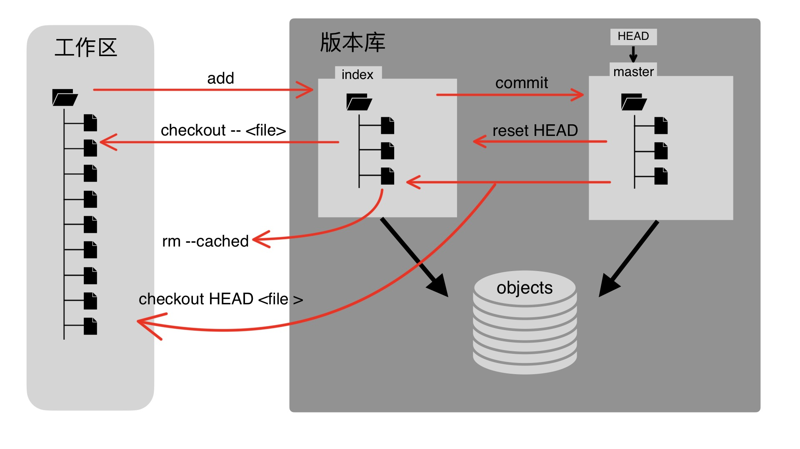
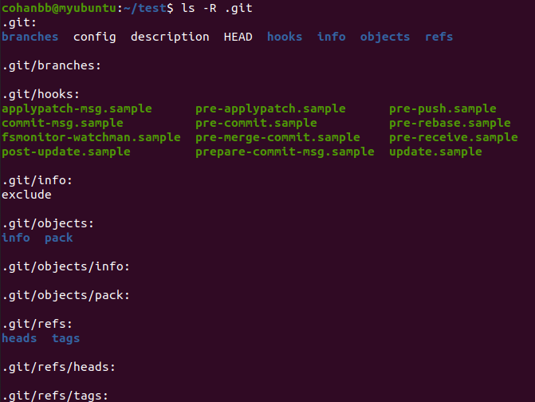
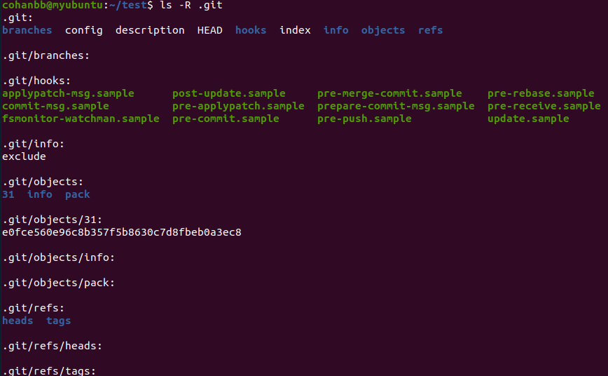
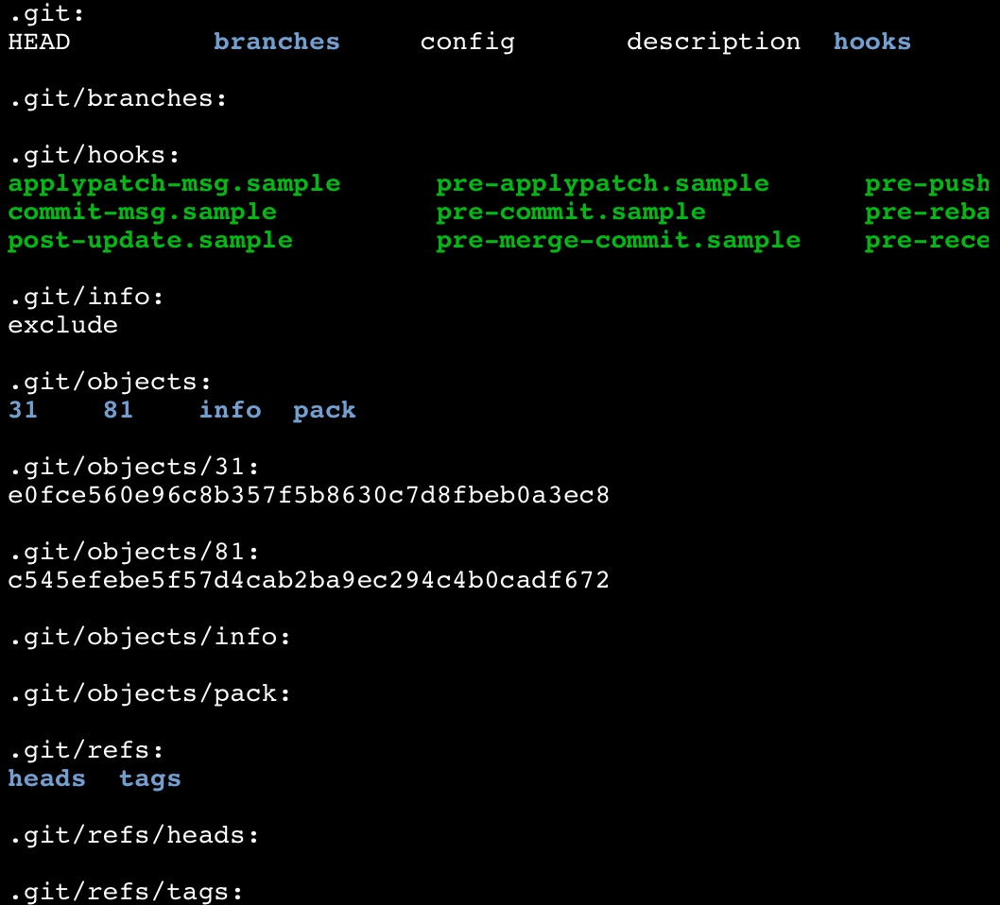
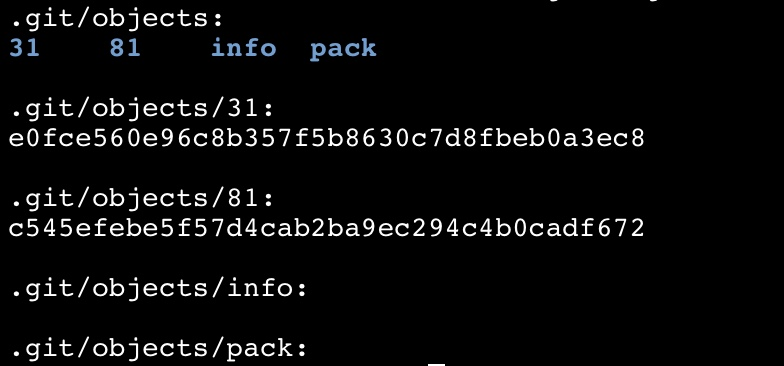
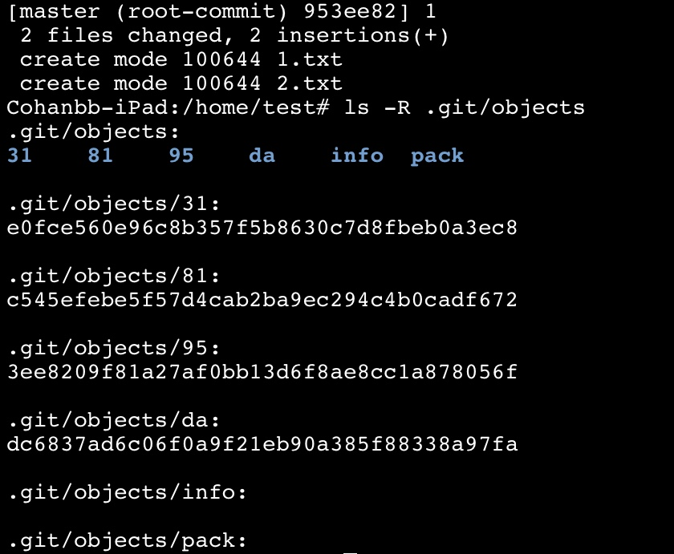
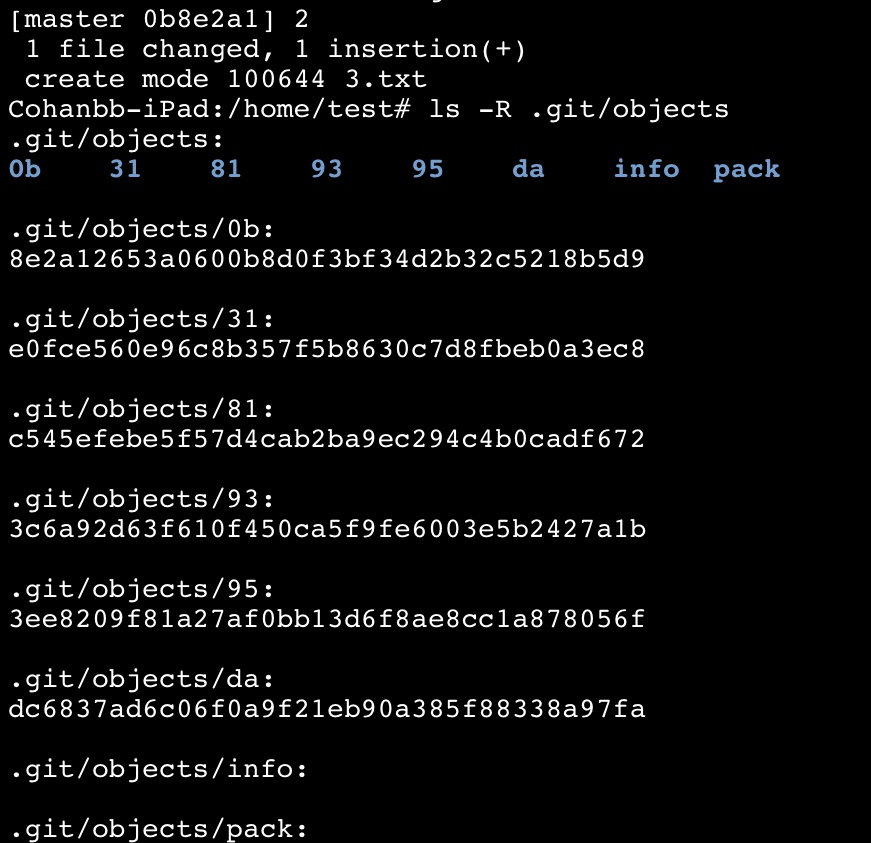

<p align="center">
    <font size="6"><strong>深入理解 Git</strong></font>
</p>

# 摘要

Git 是一个开源的分布式版本控制系统，是 Linus Torvalds 为 Linux 内核开发的开放源码的版本控制软件。与其他版本控制工具不同，Git 采用了分布式版本库的方式，同时还是一个内容管理系统，为不同设备和用户间的内容同步提供了便利。Git 目前被广泛运用在 GitHub、GitLab 以及中国的 Gitee 等代码托管和版本控制系统。

<hr>

**本文索引**  

- [摘要](#摘要)
- [Git 安装和配置](#git-安装和配置)
  - [安装 Git](#安装-git)
  - [配置 Git](#配置-git)
- [Git 原理](#git-原理)
  - [Git 基本工作流程](#git-基本工作流程)
  - [Git 工作区、暂存区和版本库](#git-工作区暂存区和版本库)
  - [深入理解 Git](#深入理解-git)
- [Git 常用命令](#git-常用命令)
  - [创建和克隆 Git 仓库](#创建和克隆-git-仓库)
  - [配置 Git](#配置-git-1)
  - [提交和修改](#提交和修改)
  - [分支](#分支)
- [GitHub](#github)
- [参考文献](#参考文献)

<hr>

# Git 安装和配置

## 安装 Git

Git 有良好的跨平台性，目前支持在 Linux、MacOS、FreeBSD 和 Windows 平台上运行。

Windows 上可进入官网下载 Git：[git download](http://git-scm.com/download/win)，若无法下载或下载缓慢可使用国内镜像：[清华大学 git for windows update 镜像](https://mirrors.tuna.tsinghua.edu.cn/github-release/git-for-windows/git/Git%20for%20Windows%202.36.1/)，下载并安装成功后将 Git 的 bin 目录加入环境变量。

Linux 上可以直接使用 shell，以 Debian 系为例：

```bash
$ apt-get install git
```

终端输入：

```bash
$ git --version
git version 2.32.1
```

若终端输出 Git 的版本号，则证明安装成功。

## 配置 Git

配置个人信息，终端输入用户名和邮箱地址：

```bash
$ git config --global user.name "your name"
$ git config --global user.email "your email"
```

# Git 原理

## Git 基本工作流程

1. 克隆 Git 资源到工作区。
2. 在工作区对资源进行修改。
3. 将工作区的资源提交。
4. 若发现提交的内容有问题，可以撤回提交。

## Git 工作区、暂存区和版本库

* 工作区：本地的资源目录。
* 暂存区：位于工作区的 .git/index 文件中。
* 版本库：位于工作区的 .git 目录。



* 使用 `git init` 可使用当前目录作为 Git 仓库，该命令会在当前目录生成一个 **.git** 目录作为版本库。
* 图中左侧为**工作区**，右侧为**版本库** 即 **.git** 目录，在版本库中有 **index** 文件代表**暂存区**。
* **HEAD** 为游标文件指向最后一次提交的分支，master 文件中存放着对象库中 master 分支的提交信息。
* **objects** 文件是 Git 的**对象库**，实际位于 .git/objects 目录，里面包含了文件内容、目录树等对象。
* 当使用 `git add` 命令时，即工作区增加或修改文件时，index 会生成新的文件信息和目录树，同时工作区增加或修改的文件内容被写入 objects 中的一个新的对象中。
* 当执行提交操作 `git commit` 的时候，index 中的目录树写入 objects 中，并生成一个提交信息，master 中写入这个提交信息，其中含有刚刚提交的目录树等信息。
* 当执行 `git reset HEAD` 命令时，index 中的目录树会被重写，被 master 中提交信息的目录树所替换，但工作区不受影响。
* 当执行 `git rm --cached <file>` 命令时，只从 index 中删除文件，工作区不受改变。
* 当执行 `git checkout .` 或者 `git checkout -- <file>` 命令时，会用 index 中全部或指定的文件替换工作区的文件。这个操作非常危险，会清除工作区中未添加到 index 的改动。
* 当执行 `git checkout HEAD .` 或者 `git checkout HEAD <file>` 命令时，会用 HEAD 指向 master 分支中全部或者部分文件替换 index 以及工作区的文件。这个文件也是极具危险性的，因为不仅会清空工作区中为提交的改动，也会清楚暂存区中未提交的改动。

## 深入理解 Git

下面以实际的操作来更深刻地理解 Git：

1. 首先生成一个目录 test 作为工作区，并初始化 git：

```bash
$ mkdir test 
$ cd test
$ git init
```

2. 可查看到初始化后的工作区有一个隐藏目录 .git，查看该目录的内容：


  
查看 .git/config 文件，并配置身份信息：

```bash
$ cat .git/config
[core]
	repositoryformatversion = 0
	filemode = true
	bare = false
	logallrefupdates = true
$ git config user.name "Cohanbb"
$ git config user.email "cohanbb777@163.com"
$ cat .git/config
[core]
	repositoryformatversion = 0
	filemode = true
	bare = false
	logallrefupdates = true
[user]
	name = Cohanbb
	email = cohanbb777@163.com
```

3. 新建一个文件 1.txt 添加内容“helloworld”，并使用 `git add 1.txt`，之后再次查看 .git 目录的内容：

```bash
$ touch 1.txt
$ echo "helloworld" > 1.txt
$ cat 1.txt
helloworld
$ git add 1.txt
#再次查看 .git 目录内容
$ ls -R .git
```


发现与之前相比多了两个文件：

  * index 文件 
  * objects/31 目录以及目录下的文件 e0fce560e96c8b357f5b8630c7d8fbeb0a3ec8

index 文件是暂存区，无法直接查看，objects/31 是新生成的对象，e0fce560e96c8b357f5b8630c7d8fbeb0a3ec8 是以哈希为名的文件，使用 `git cat-file -p` 可以读取该文件的内容：

```bash
$ git cat-file -p 31e0fce560e96c8b357f5b8630c7d8fbeb0a3ec8
helloworld
```

4. 在工作区新建文件文件 2.txt 添加内容“1234”，并使用 `git add 2.txt`，再次查看 .git 目录的内容：

```bash
$ touch 2.txt
$ echo "1234" > 2.txt
$ git add 2.txt
$ ls -R .git
```



发现 object 目录下生成了一个新的对象 81，使用 `git cat-file -p 81c545efebe5f57d4cab2ba9ec294c4b0cadf672` 进行读取得到 1234。

5. 修改 1.txt 文件的内容，修改为 “1234”，并使用 `git add 1.txt`，再次查看 .git/objects 目录的内容： 

```bash
$ echo "1234" > 1.txt
$ git add 1.txt
$ ls -R .git/objects
```



发现与之前没有任何该改变，故可知 objects 目录里的对象仅仅存储添加/修改的文件内容，与文件的名称无关。

直接查看 index 文件的内容，发现是乱码，但可看到刚刚创建的文件名 1.txt 和 2.txt：

```bash
$ cat .git/index
DIRCb���
        ��b���
              ��~3�����E����}L�+��)LK
                                     ��r1.txtb��P"_�b��P"_�~3�����E����}L�+��)LK
                   ��r2.txt0�8��?D.JN��

                                       u���
```

实际上 index 文件是虚拟的工作区，但仅仅是一个文件索引，包含了工作区的目录树，目录树上存储了各文件的文件名、文件的最终修改时间、文件的长度、文件的类型以及文件的哈希值。   
文件的具体内容并未存储在 index，而是存储在 objects 目录之中。objects 目录中除了 info 和 pack 其他的目录名称都是两个字符构成，这是因为文件的哈希值有 40 位，取前两位作为目录，后 38 位作为目录下的文件名。

在 objects 目录下，存有四种类型的哈希值：blob 型、tree 型、commit 型和 parent 型。

* blob 型用来存储添加/修改文件的内容
* tree 型存储某个目录下的文件信息，包括文件名、文件权限、文件的哈希值
* commit 型存储提交的信息
* parent 型存储上一次提交产生的 commit 

到这里仍然觉得一头雾水，再做一个实验来深刻理解他们的运作过程：

1. 在刚刚实验的基础上，使用 `git commit` 命令进行提交，并查看 objects 目录的内容：

```bash
$ git commit -m '1'
$ ls -R .git/objects
```



与之前向比多了哪些内容呢？多了两个新的对象：95 和 da，读取这两条哈希值的类型和内容：

```bash
$ git cat-file -t 953ee820
commit #commit 型
$ git cat-file -t dadc6837
tree #tree 型
$ git cat-file -p 953ee820 
#commit 型的内容
tree dadc6837ad6c06f0a9f21eb90a385f88338a97fa
author Cohanbb <cohanbb777@163.com> 1654056297 +0000
committer Cohanbb <cohanbb777@163.com> 1654056297 +0000

1 
$ git cat-file -p dadc6837
#tree 型的内容
100644 blob 81c545efebe5f57d4cab2ba9ec294c4b0cadf672    1.txt
100644 blob 81c545efebe5f57d4cab2ba9ec294c4b0cadf672    2.txt 
```

可看出 95 对象为 commit 型的哈希值，da 对象为 tree 型的哈希值，commit 里面存储了提交的目录树、作者和提交者的身份信息以及提交的名称。tree 里面存储了提交文件的权限、提交文件的哈希值及其类型、提交的文件名。

2. 创建一个新的文件 3.txt 添加内容 “1234”，并使用 `git add` 以及 `git commit` 提交：

```bash
$ touch 3.txt
$ echo "1234" > 3.txt
$ git add 3.txt
$ git commit -m '2'
```



发现新增了 0b 和 93 两个新的对象，依然是读取他们的哈希类型和内容：

```bash
$ git cat-file -t 0b8e2a12
commit
$ git cat-file -t 933c6a92
tree
$ git cat-file -p 0b8e2a12
tree 933c6a92d63f610f450ca5f9fe6003e5b2427a1b
parent 953ee8209f81a27af0bb13d6f8ae8cc1a878056f
author Cohanbb <cohanbb777@163.com> 1654057402 +0000
committer Cohanbb <cohanbb777@163.com> 1654057402 +0000

2
$ git cat-file -p 933c6a92
100644 blob 81c545efebe5f57d4cab2ba9ec294c4b0cadf672    1.txt
100644 blob 81c545efebe5f57d4cab2ba9ec294c4b0cadf672    2.txt
100644 blob 81c545efebe5f57d4cab2ba9ec294c4b0cadf672    3.txt
```

发现这次的 commit 与上一次有所不同，即多了一个 parent 项，观察发现这一项是上一次提交产生的 commit。tree 里面存储了三个文件的信息。 

此时我们来查看一下 HEAD 的内容：

```bash
$ cat .git/HEAD 
ref: refs/heads/master
```

出现一个文件的路径，查看 refs/heads/master 文件的内容：

```bash
$ cat .git/refs/heads/master
0b8e2a12653a0600b8d0f3bf34d2b32c5218b5d9
$ git cat-file -p 0b8e2a12
tree 933c6a92d63f610f450ca5f9fe6003e5b2427a1b
parent 953ee8209f81a27af0bb13d6f8ae8cc1a878056f
author Cohanbb <cohanbb777@163.com> 1654057402 +0000
committer Cohanbb <cohanbb777@163.com> 1654057402 +0000

2
```

发现 master 文件中存储着一个哈希值，正是刚刚提交所生成的 commit。


**总结**  
index 是工作区的一个文件索引，存储着各文件各版本的信息，但是并没有存放文件的具体内容，当执行 `git add` 操作，文件的具体内容被存放在 objects 中的 blob 对象中，当执行 `git commit` 操作，index 将目录树存入 objects 并生成了 commit 对象，HEAD 指向最后一次提交的分支，master 中存放刚生成的 commit 对象，包含 tree 对象、作者的身份信息等。

# Git 常用命令

## 创建和克隆 Git 仓库

```bash
git init #初始化仓库

git clone <repository> #克隆仓库到本地
git clone <repository> <directory> #克隆仓库到指定目录下
```

## 配置 Git

```bash
git config --list #列出 git 配置
git config -e #编辑 git 配置
git config -e --global #编辑全局 git 配置 
```

## 提交和修改

```bash
git add <file1> <file2> ... #添加一个或者多个文件到暂存区
git add <dir> #添加指定目录到缓存区

git status #查看上次提交之后有无对文件进行再次的修改

git diff <file> #显示缓存区和工作区文件的差异
git diff --cached <file> #显示暂存区和上一次提交的差异

git commit <file1> <file2> ... -m <message> #提交暂存区的文件到仓库区
git commit -a #不需要 git add 直接提交

git reset --mixed <HEAD> #重置暂存区与上一次提交的保持一致
git reset --soft <HEAD> #退回到某个版本 
git reset --hard <HEAD> #撤销工作区所有未提交的修改内容，将暂存区和工作区都回到上一次的版本，并删除之前的所有信息提交

git rm -f <file> #删除暂存区和工作区的文件
git rm --cached <file> #仅仅删除暂存区的文件，工作区的文件仍然保留

git mv <file> <newfile> #移动或重命名一个文件、目录或软链接

git log #查看历史提交记录
git blame <file> #以列表的形式查看指定文件的修改历史

git remote #操作远程仓库
git fetch # 从远程仓库取代码库
git pull #下载远程代码并合并
git push #上传远程代码并合并
```

## 分支
每一种版本控制系统都支持分支，一个分支代表一条独立的开发线，使用分支意味着可以从开发主线上分离开，然后在不影响主线的同时继续工作。

Git 的分支即意味着与 master 分支提交的内容独立，在 master 分支提交的内容不会影响其他分支，在其他分支提交的内容也不会影响 master。  

>注意：在任何分支进行提交操作之前，工作区的修改内容在任何分支都可见，一旦有任何分支进行提交操作，则其他分支回到上次提交操作后的状态。  

基本使用方法：

```bash
git branch # 列出分支
git branch <branchname> #创建分支
git checkout <branchname> #切换分支
git merge <branchname> #合并分支
git branch -d  <branchname> #删除分支
```
# GitHub

GitHub 是基于 Git 的代码托管和版本控制平台，可以在上面创建仓库或项目。

首先需要注册一个 GitHub 账号，然后在本地创建 SSH KEY：

```bash
$ ssh-keygen -t rsa -b 4096 -C "your email"
```

公钥在 ~/.ssh/id_rsa.pub 中，进入 GitHub 进入 account settings 选择 SSH Keys，Add SSH Key，添加在电脑上生成的公钥。添加后使用下面的命令验证是否成功：

```bash
$ ssh -T git@github.com
```

会弹出警告，输入 yes 就行了。然后在本地配置 Git：

```bash
$ git config --global user.name "your name"
$ git config --global user.email "your email"  
```

在 GitHub 新建一个仓库（repositry），譬如 mycode，然后即可在本地进行远程仓库操作：

```bash
$ mkdir mycode #创建本地仓库
$ cd mycode
$ git init
$ touch hello.md
$ echo "this is mycode" > hello.md
$ git add .
$ git commit -m "添加 hello.md"
```

然后添加远程仓库的 SSH 地址：

```bash
$ git remote add origin git@github.com:yourName/yourRepo.git
```

其中 yourName 是 GitHub 的用户名 yourRepo 是要上传的 GitHub 仓库名。

```bash
$ git push #提交给远程仓库
$ git pull #从远程仓库获取代码并与本地的代码库合并
```

需要注意的一点是，GitHub 的默认主分支的名称不再是 master 而是 main，故最好将 Git 的默认主分支名称也改为 main：

```bash
$ git config --global init.defaultBranch main
```

其他操作并不影响，上述与 master 有关的所有内容都替换 main 即可。

# 参考文献

[1] 菜鸟教程. Git 教程[EB/OL]. https://www.runoob.com/git/git-tutorial.html  
[2] 菜鸟教程. Github 简明教程[EB/OL]. https://www.runoob.com/w3cnote/git-guide.html  
[3] VGtime. Git基本原理介绍[EB/OL]. https://blog.csdn.net/JKR10000/article/details/110453547  
[4] raoxiaoya. git深入理解(一)：暂存区(Stage)，索引(index)[EB/OL]. https://blog.csdn.net/raoxiaoya/article/details/110824019
